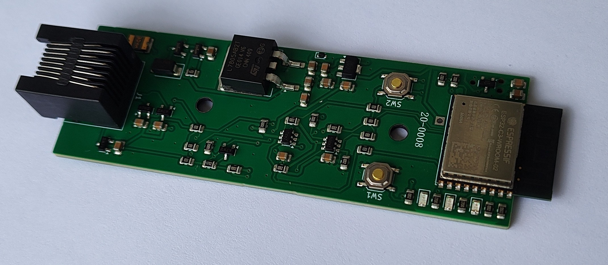

# ESPHome GE Laundry UART

Local Home Assistant control and monitoring for compatible GE appliances through ESPHome and the appliance's GEA serial bus.

> [!WARNING]
> The appliance uses an 8P8C modular connector that looks like Ethernet, but it is **not Ethernet**. Do not connect it to network equipment.

The project began as an effort to integrate a GE washer and dryer with Home Assistant. An ESP32 powered by the appliance communication port reports information such as remaining time and cycle completion through ESPHome. Early work involved researching the GEA2 and GEA3 protocols and the U+ Connect module; later, [GE Appliances](https://github.com/geappliances) and [FirstBuild](https://firstbuild.com/inventions/home-assistant-adapter/) published additional hardware and protocol information. The maintained ESPHome implementation now lives in [mguaylam/esphome-gea](https://github.com/mguaylam/esphome-gea), while this repository provides compatible hardware, reference configurations, manufacturing files, and enclosures.

## Getting started

### I already have a board

Follow the [firmware setup guide](firmware/README.md) to choose a GEA2 or GEA3 configuration, flash the board, connect it to Home Assistant, and check the status LEDs. The [Rev 2 enclosure](case/rev2/README.md) includes ready-to-print files.

### I want to order a board

Start with [PCB Rev 2.2](pcb/rev2.2/README.md), then follow the [step-by-step ordering guide](pcb/ORDERING.md). Rev 2.2 corrects the known Rev 2.0 and Rev 2.1 board-file problems.

**Current status:** Rev 2.2 is the recommended manufacturing candidate; physical testing is still pending. A JLCPCB quote checked on September 19, 2026 was **$78.07 before shipping and tax for five fully assembled boards**, or about **$15.61 per board**. Prices and component availability can change.

Older boards and the complete change history are listed in the [PCB revision index](pcb/README.md). Hardware contributors should also read the [contribution guide](CONTRIBUTING.md).

### I want to help test new hardware

[PCB Rev 3A](pcb/rev3a/README.md) is the current prototype design. It adds
USB-C, automatic pin-1/pin-3 appliance-power selection, a switching regulator,
a recovery header, and a matching printable enclosure. Its design files and
manufacturing package pass KiCad's automated checks, but the board has not yet
completed physical bring-up. A September 19, 2026 JLCPCB quote was $149.96 before
shipping and tax for five fully assembled boards, or $29.99 per board. Review the
[Rev 3A validation package](pcb/rev3a/validation/README.md)
and [prototype procedure](pcb/rev3a/BRINGUP.md) before ordering or testing it.

## Related projects

- [GE Appliances organization](https://github.com/geappliances)
- [FirstBuild Home Assistant adapter](https://firstbuild.com/inventions/home-assistant-adapter/)
- [puddly/casserole](https://github.com/puddly/casserole)
- [GEMakers/green-bean](https://github.com/GEMakers/green-bean)
- [doitaljosh/gea-interface-board](https://github.com/doitaljosh/gea-interface-board)
- [doitaljosh/ge-appliances-re](https://github.com/doitaljosh/ge-appliances-re)
- [doitaljosh/geabus-documentation](https://github.com/doitaljosh/geabus-documentation)
- [simbaja/gehome](https://github.com/simbaja/gehome)
- [GE Appliances Home Assistant adapter](https://github.com/geappliances/home-assistant-adapter)
- [GE Appliances Home Assistant examples](https://github.com/geappliances/home-assistant-examples)
- [GE Appliances Home Assistant bridge](https://github.com/geappliances/home-assistant-bridge)
