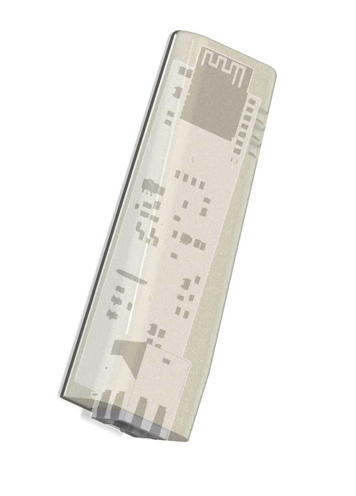
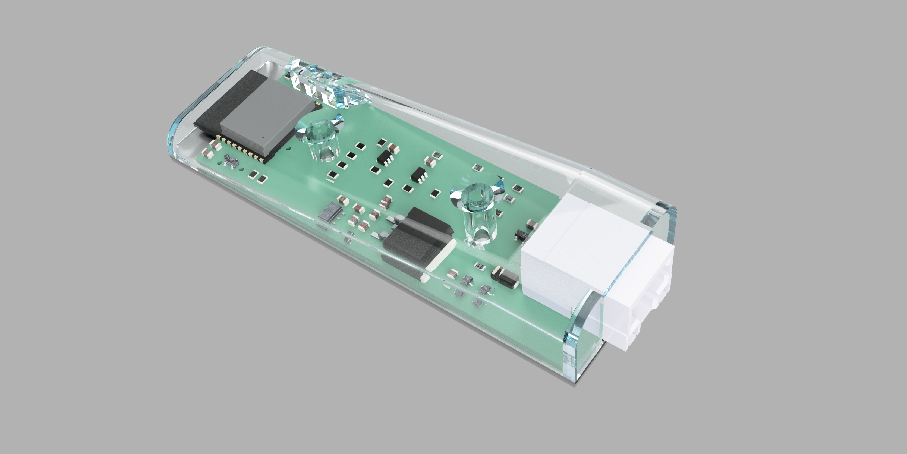
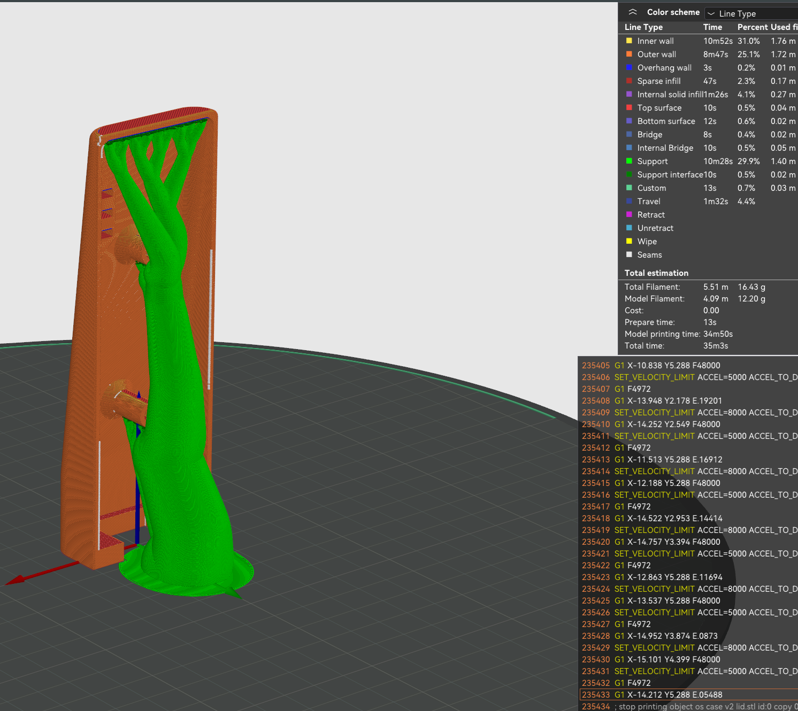

# Rev 2 enclosure

This enclosure was designed around the Rev 2.x PCB outline. The editable Fusion 360 archive, neutral CAD export, printable STL files, and documentation images are kept separately.

*Exterior enclosure render.*

*Exploded enclosure view showing the board position.*

## Files

- [Editable Fusion 360 archive](v2-case.f3z)
- [STEP export](exports/v2-case.step)
- [Base STL](exports/v2-case-base.stl)
- [Lid STL](exports/v2-case-lid.stl)
- [Case render](images/case-render.png)
- [Enclosed-board render](images/enclosure-render.png)
- [Example support arrangement](images/print-supports.png)

*Example slicer support arrangement.*

The support image is an example, not a required slicer profile. Confirm orientation, support placement, connector access, button access, antenna clearance, and populated-board fit before relying on a print.

[Back to the enclosure index](../README.md) · [PCB revisions](../../pcb/README.md)
