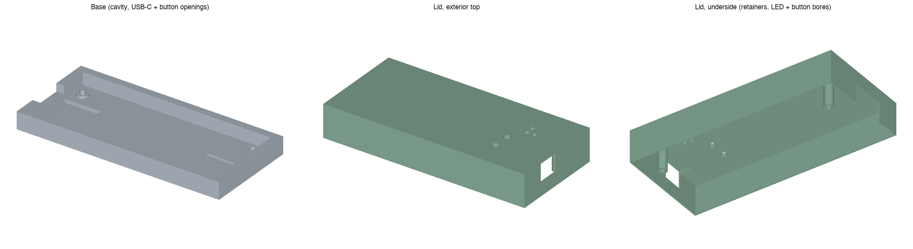

# Rev3C printable enclosure (socketed XIAO)

A two-piece printable case for a candidate Rev3C carrier that sockets a
**factory pre-soldered, pre-headered** retail XIAO ESP32-C3 module instead
of soldering it down flush, the way [Rev3B](../rev3b/README.md) does. Both
the carrier (with its two female sockets) and the module (with its male
header) ship fully assembled — nothing is soldered as part of installing
this case.



This is a prototype candidate, not a physical-fit, electrical, thermal, or
RF qualification. [Rev3B](../rev3b/README.md) is unmodified; this is a
separate variant. Socket positions match the routed Rev3C PCB; button and
USB positions follow Seeed's published module layout. The assembled
height still needs a physical check (see "Assumptions" below).

## Installation

1. With **all power disconnected**, press the pre-soldered XIAO module
   straight down into both female header rows until fully seated — USB-C
   faces the case's USB opening. Align all 14 pins across both rows before
   pressing down, and check that none overhang the sockets.
2. Place the assembled carrier board into the base on its two locating
   posts, then fit the lid.
3. Check USB-C insertion, BOOT0/RST0 reach through their lid tool holes,
   and LED visibility.
4. Never apply 5 V to a 3V3/signal pin. Use the side-pin UART/BOOT pins or
   the onboard RESET button for recovery; J2 remains available internally
   (lid removal only) as a backup. Power from only **one** source at a
   time — USB, *or* appliance power, *or* regulated 5 V via J2, never more
   than one at once — the case provides no electrical interlock.

## Files and variants

* [`enclosure.py`](enclosure.py) — parametric build123d source.
* [`check_geometry.py`](check_geometry.py) — manifold STL/STEP checks,
  component/tail-relief clearance, connector corridor, LED/button
  sightline, and magnet-pocket checks; see its docstring for optional
  native-pcbnew cross-checks.
* Default: [base STL](exports/rev3c_base.stl), [base STEP](exports/rev3c_base.step),
  [lid STL](exports/rev3c_lid.stl), [lid STEP](exports/rev3c_lid.step).
* Internal antenna (`--antenna internal`):
  [base STL](exports/rev3c_base_ant-internal.stl), [base STEP](exports/rev3c_base_ant-internal.step),
  [lid STL](exports/rev3c_lid_ant-internal.stl), [lid STEP](exports/rev3c_lid_ant-internal.step).
* External bulkhead (`--antenna external`):
  [base STL](exports/rev3c_base_ant-external.stl), [base STEP](exports/rev3c_base_ant-external.step),
  [lid STL](exports/rev3c_lid_ant-external.stl), [lid STEP](exports/rev3c_lid_ant-external.step).
* Captive magnets (`--magnets`):
  [base STL](exports/rev3c_base_magnets.stl), [base STEP](exports/rev3c_base_magnets.step),
  [lid STL](exports/rev3c_lid_magnets.stl), [lid STEP](exports/rev3c_lid_magnets.step).

```sh
pip install -r requirements.txt
python enclosure.py
python enclosure.py --antenna internal
python enclosure.py --antenna external
python enclosure.py --magnets
python check_geometry.py
```

## What's different from Rev3B

Rev3B solders the XIAO flush (zero standoff). Rev3C sockets a pre-soldered
module on two 1x7 **HCTL PM254-1-07-Z-8.5** female headers
([LCSC C2897370](https://www.lcsc.com/product-detail/C2897370.html)), so the
module sits well above the carrier and its USB-C connector and buttons move
up and across accordingly:

* **USB-C window**: taller, sized for the socketed module's own USB-C
  footprint and covering the full plausible assembled-height range (see
  "Assumptions"), not the bare carrier pads.
* **BOOT0/RST0 tool holes**: moved to the module's actual button positions
  near its left edge — both bored straight through the lid, never
  contacting the switches at rest.
* **Under-board tail relief**: each socket row gets its own relief pocket in
  the base floor, the same construction Rev3B already uses for the RJ45
  (J1) tails.

J1 (RJ45), J2 (recovery header, lid-removal-only), the three status LEDs,
the two board mounting posts, and the antenna/magnet variants are unchanged
from [Rev3B](../rev3b/README.md).

## Assumptions

* **Socket body: 8.5 ± 0.15 mm, 18.18 × 2.5 mm footprint — manufacturer-
  confirmed** from the HCTL PM254-1-07-Z-8.5 datasheet (LCSC C2897370).
* **Male pin-header spacer height (the module's own plastic base above the
  socket) and the module's complete top-side envelope are NOT
  manufacturer-confirmed** for this specific pre-soldered SKU. The case
  reserves a provisional 2.0–3.0 mm spacer range and a provisional 5.5 mm
  module envelope (already including the module's own 1.6 mm PCB); both are
  named placeholders, not measurements, and the USB-C window is sized to
  cover that full plausible range.
* Socket positions were checked against the carrier PCB, and button/USB
  positions against Seeed's module CAD. Neither check establishes physical fit.
* Mating insertion depth between socket and module pins is not dimensioned
  on the available drawing.
* No retention rib touches the module: there's no verified bare-laminate
  landing zone distinct from its buttons/USB-C/U.FL footprint to add one
  without risking contact. Retention relies on the sockets' own pin
  friction, same as any 2.54 mm header socket — check that the module stays
  seated under vibration and USB cable insertion/removal force on a bench
  before relying on it in a laundry-appliance environment.
* BOOT0/RST0 tool-hole sizing reuses Rev3B's conservative 1.75 mm access
  radius; the switch body's actual size has not been confirmed from a
  datasheet, so tool fit/actuator travel still need a physical check.

The antenna and magnet variants carry the same caveats already documented
in [`../rev3b/README.md`](../rev3b/README.md) (conservative clearance
solids, not manufacturer CAD; magnet material/holding force untested).

## Prototype gate and safety

Print base and lid separately and test with the module seated, unpowered.
Check USB-C insertion/strain-relief clearance, BOOT0/RST0 reach and
release, module seating under gentle shake/tug, LED visibility, J2 access
with the lid removed, and RJ45 insertion/latch clearance. Power from only
one source at a time — USB, or appliance power, or regulated 5 V via J2,
never more than one at once. Existing power/transient qualifications for
this board remain unresolved and are not promoted as safe for general
appliance use.
