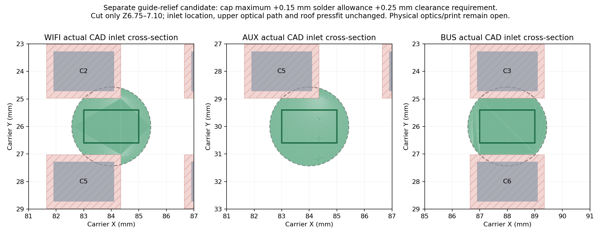

# Rev3C pre-order mechanical analysis, 5 October 2026

**The enclosure remains a prototype. Original fixed button reaches fail nominal actuation at the 11.0 mm installed stack, and the common closure has no physical protection against fitting a C3 lid to C6.** This review advances the CAD and clearance evidence without making an order, circuit change, physical-fit, fatigue, thermal or RF claim.

The selected 99 × 40 mm carrier, both inputs through the same J1 appliance 8P8C connector, automatic priority, selected 40 V switches and all component placements remain unchanged. The recovered originals and shared integration checkout were preserved. All work here is isolated. Carrier source commit: `8744a29446a1937134525496c2a5dfdc0a59a004`; PCB SHA-256: `4fba3feea4161f7e6bdfbd7f20ac677a485948fac540d7bda1c246a451c4bab9`.

## What was actually run

Inspected and regenerated actual tapered snap-case source with installed **build123d 0.10.0 / cadquery-ocp 7.8.1.1.post1**. No installation or alternate download was attempted. The historical requirement remains build123d 0.11.1 / trimesh 5.1.0; this analytical lane is explicitly a different tool version and does not close pinned regeneration. NumPy 2.3.5 and Matplotlib 3.10.8 produced diagnostic plots; Blender 4.3.2 rendered the freshly generated meshes. Exact versions, input/output hashes, dimensions and check results are in the receipts.

All four original-reach C3/C6 × internal/external lids and the common base were evaluated. Installed module-bottom stack was sampled at 11.0, 11.325 and 11.65 mm for solid intersections, with six 0.13 mm stack steps for reach/travel calculations. USB aperture, independent button parameters, rigid cap/shaft/tip diagnostic envelopes, light-guide insertion and maximum FPC/bulkhead screens were evaluated separately. Elastic beam roots were never falsely rigid-translated. The full case run used conservative 3 mm cap screens; their bounds are retained beside the later primary maxima. Final candidate proof confirms unchanged default case geometry, and affected guide checks were rerun with primary dimensions and explicit allowances. These are new bounded checks; the historical claims of 1,168/27 checks are **not reproduced**.

Retained selected-part/module STEP files were independently imported and registered. C3 has 1,083 valid solids; C6 has 907. Their native Y is reflected into the case's +KiCad-Y datum, then translated by `(87.89,12.9175,5.25+installed_stack)` with no scaling. Their retained partial top-side maximum is 4.905 mm above module underside. Omitted switches, antenna, chips, male headers and populated/TBD parts are not zero-height geometry.

## Source-bound result matrix

PASS below means the stated nominal/proxy geometry passed the stated check. It is not an all-tolerance manufacturing pass.

| Check | C3 internal | C3 external | C6 internal | C6 external | Evidence and limit |
|---|---|---|---|---|---|
| Valid, single-solid case parts | PASS | PASS | PASS | PASS | Actual generated geometry, not an old cassette render |
| Case versus current registered body screens at three installed stacks | PASS | PASS | PASS | PASS | Selected U9/U10 and F1/F2 drawing maxima included; Six neighboring caps now use primary manufacturer maxima; D20 and other missing models use explicitly assumed screens |
| Original fixed reaches at 11.0 mm | FAIL | FAIL | FAIL | FAIL | 0.90 mm release gap; 0.50/0.54 mm residual gap at cap stop |
| Per-assembly conditional nominal contact/depression | PASS* | PASS* | PASS* | PASS* | 0.25 mm release gap gives 0.15/0.11 mm nominal depression; electrical make, exact switch identity and permitted travel unresolved |
| Worst-case make and safe overtravel | UNKNOWN | UNKNOWN | UNKNOWN | UNKNOWN | No manufacturer maximum overtravel/force bound; print, seating, solder and closure errors unmeasured |
| C3 lid cannot be fitted to C6 | FAIL | FAIL | FAIL | FAIL | Common base/closure has no physical module key |
| Source USB shell screen / 12 × 6 mm synthetic plug gauge | PASS | PASS | PASS | PASS | Fixed and stack-shifted apertures; actual plug shank/body/strain relief remains UNKNOWN |
| 14 × 8 mm synthetic plug gauge | FAIL | FAIL | FAIL | FAIL | Rounded corners clip the gauge; aperture bounding rectangle alone is misleading |
| J1 nominal body / documented tail envelope | PASS | PASS | PASS | PASS | Actual plug/latch access, locating posts and solder blobs remain UNKNOWN |
| Guide versus nearby current capacitors | PASS*/UNKNOWN | PASS*/UNKNOWN | PASS*/UNKNOWN | PASS*/UNKNOWN | Primary maximum bodies clear at zero solder lift with only 0.05 mm vertical margin; 0.10 mm lift causes intersections |
| Corrected guide candidate cap-clearance/inlet/retention screen | PASS* | PASS* | PASS* | PASS* | Three alternative guides preserve nominal inlet and roof fit; 0.15 mm solder allowance +0.25 mm clearance are design requirements, physical optics unknown |
| FPC maximum final envelope | PASS | N/A | N/A | N/A | 40.3 × 20.2 × 1.8 mm slab; film/feed/catch insertion and cable routing remain UNKNOWN |
| Ceramic maximum XY / U.FL maximum body screen | N/A | N/A | PASS* | PASS* | Correct C6 XY; ceramic Z maximum and fitted/mated connectors remain UNKNOWN |
| Bulkhead nominal hole/land/nut/washer screen | N/A | PASS* | N/A | PASS* | 1.5 mm land equals connector maximum panel thickness; print tolerance/torque/crushing unknown |
| Snap tip movement / sampled compressed insertion poses | PASS* | PASS* | PASS* | PASS* | Common geometry, 0.8 mm rigid tip screen and only 0.05 mm stop margin; elasticity and printed fit unproven |
| PETG print, lifetime, thermal, optical and RF behavior | UNKNOWN | UNKNOWN | UNKNOWN | UNKNOWN | Physical gates remain open |

## Buttons and a reviewable candidate

Carrier underside/top are Z3.65/5.25. An installed stack of 11.0–11.65 puts module underside at Z16.25–16.90. Conditional C3 switch height is 1.5 mm above its 1.6 mm PCB; the unverified 1.7 mm family option is also swept. C6 uses conditional Alps SKTAAAE010 0.53 ±0.10 mm, despite the source schematic naming TS-1001S. Actuator target/supplier identity remains a physical gate.

Original feet end at Z20.25 C3 / Z19.28 C6. At 11.0 mm, neither reaches its switch at the original 0.40/0.36 mm cap stop. At 11.65 mm they just reach conditional nominal travel, leaving no tolerance proof. Calibrating reach to each nominal assembly restores nominal 0.25 mm release gap, but the C6 height bounds alone yield **0.01–0.21 mm** depression. A C3 1.7 mm switch under a reach set for the 1.5 mm option gives 0.35 mm depression. Nominal travel is not an allowed-overtravel specification.

The isolated candidate's `configure()` actually changes stack, original/per-assembly reach, independent BOOT/RESET switch height, release gap, stop motion and USB aperture Z. The main electronics proxy now follows those parameters and current carrier bounds. Unused historical FLEX_L/STROKE controls are removed; TRAVEL supplies functional defaults. No value is presented as a safe calibrated retail assembly.

A separate C3 root/slot candidate extends the actual leaf-root offset from 16.6 to 17.3 mm, keeping a 1 mm root bond, original exterior and exact contact XY. Effective spans increase from **13.221–14.297 to 13.921–14.997 mm**. At 0.4 mm displacement the ideal fixed-guided screen falls from **0.470–0.549% to 0.427–0.495%**. Both are valid single solids. This narrowly clears the prior self-imposed 0.5% nominal screen; it does not establish material life or tolerance margin. PETG modulus/beam idealization, roots, shaft friction, off-centre loading, conditioning and print defects need coupons.

Wrong-lid contact is independently demonstrated: C3 BOOT is 0.190 mm from the C6 U.FL datum and its stop envelope intersects the 1.45 mm-height bare U.FL maximum screen. C3 RESET projects within ceramic maximum XY. Labels cannot prevent installation. No unsupported key or retention landing was invented.

## Connectors, tails, indicators and antennas

The rounded USB opening is 14.8 × 9 mm with 2.2 mm corner radius. Original center is Y12.9175/Z20.7; optional per-assembly Z shift is `installed_stack−11.65`. Connector screens clear both versions throughout the sampled stack. A centered 12 × 6 mm engineering plug-body gauge fits; a 14 × 8 mm one does not. Neither represents a selected real plug. The connector face is recessed roughly 4.3–4.4 mm behind the outside wall at its mating height, so plug shank length, full insertion, fingers and strain relief must be checked.

Current EVERCOM J1 body is X−0.38–17.67/Y9.395–24.595/Z5.25–16.70. Its rectangular opening leaves nominal Y margins 1.655/1.330 and Z margins 0.50/1.50 mm. Front is roughly 7.12 mm inside the base's extreme left edge. Signal tails end at nominal Z2.25 above pocket floor Z0.65. Maximum socket-tail prism ends at Z1.80 above pocket floor Z1.25, giving **0.55 mm** nominal vertical margin. Actual solder blobs, male-pin engagement/protrusion and locating-post barbs remain unmodeled; drawing versus footprint post pitch is still 11.50 versus 11.43 mm. Base pocket skins are 1.65 mm J1 / 2.25 mm socket relative to this tapered base's Z−1 bottom.

Actual guide paths run D4 `(84,26)` → WIFI `(70,32)`, D5 `(84,30)` → AUX `(80.25,32)`, D6 `(88,26)` → BUS `(90.5,32)`. Z knees are 6.75/9.00/26.80/30.48; centerline lengths are about 29.36/24.23/24.88 mm. Five sampled upward guide-insertion poses per path clear the lid outside the intended pressfit band; final deliberate band intersection is 0.316673 mm³ per guide. Short roof collars retain a 0.12 mm diametral pressfit band. Optical gap depends on the actual LED/solder height. The first conservative courtyard/3 mm-height screen flagged C2/C3/C5/C6. Primary Yageo maxima for C2/C20/C21 (CC0805KKX7R9BB105) and C3/C5/C6 (CC0805KKX7R0BB104) are 2.20 ×1.45 ×1.45 mm. At zero solder lift, their Z6.70 tops clear the Z6.75 guide inlet by only **0.05 mm**. The explicit 0/0.025/0.05/0.10 mm solder-lift sweep is clear through 0.05 mm, but at 0.10 mm produces WIFI/AUX intersections of 0.004153 mm³ per affected cap and BUS intersections of 0.006767 mm³. Real solder/print/warp bounds are absent, so complete assembly clearance stays UNKNOWN. The new maximum bodies through 0.10 mm lift are proven subsets of the previous case-clearance screens; case clearance does not need a duplicate full run. WIFI means connection, BUS means valid receive in the previous 30 seconds, AUX is manual red/off at startup.

Maximum C3 FPC final slab fits the source rails with nominal left/right/entry/back gaps **0.45/0.45/0.20/0.30 mm** and 0.15 mm above the shallow rail lip. Its film thickness, feed point, on-patch lead, insertion through the spring catch, connector seating and lid-opening slack remain unknown. Cable screen is 1.23 mm OD and 78–82 mm length; no source minimum bend was verified.

C6 ceramic maximum XY is X77.5285–79.7285/Y13.3415–18.7415. The analytical 1.2 mm height is explicitly an assumed screen, not a verified Z maximum. U.FL body screen uses 3.1 × 3.0 × 1.45 mm; plug/termination bodies remain absent.

External D-flat hole is Ø6.5 with a 6.0 mm opposite-edge-to-flat datum, at X56/Z15.5. Nut AF8 ×1.6 and washer OD10.2 ×0.5 fit the nominal Ø12 recess; radial washer margin is 0.9 mm. The land is nominal 1.5 mm, exactly the allowed maximum, without a printed tolerance allowance. RG178 requires ≥1.83 mm collision diameter and ≥11 mm centerline bend screen; 99–105 mm cable length alone does not prove the full routed/termination/slack envelope. Full whip envelope is 120 ×10.7 mm; panel crushing, anti-rotation, independent cable restraint and whip leverage are physical gates. Remote extension/support is outside this nominal case check.

## Separate light-guide clearance correction

The original guides have insufficient robust clearance to the now-verified cap maxima. A separate `pipe_with_cap_relief()` candidate removes only local lower crescents beside those capacitors. Its explicit design requirements are **0.15 mm solder/assembly allowance plus 0.25 mm clearance** around each maximum cap body. These are chosen requirements for a trial, not manufacturer-guaranteed standoff or printer capability.

All three corrected guides are valid single solids and have zero intersections with the current neighbor models, caps at the 0.15 mm allowance and their 0.25 mm expanded clearance envelopes. Five insertion poses per guide remain clear outside the deliberate pressfit. Material above Z7.10 is unchanged, preserving all roof collars/retention and the source paths. The nominal **2 ×1.2 mm LED body/inlet projection** at unchanged Z6.75 is fully preserved.

Lower inlet area changes from 6.424 mm² circular to **5.595 WIFI /6.010 AUX /5.313 BUS mm²**, with only 0.290/0.145/0.389 mm³ removed. The relief is 0.35 mm high; no guide is moved and no contact is added to electronics. Edge light/reflection, actual emitter/solder height, translucency, surface roughness, retention and printing still need testing. This is a separately labeled correction candidate, not a physically selected release. The original guides remain available for comparison.

## Printing and next evidence

Base floor down and lid roof-face down place button and latch beam lengths in XY. This is a source-supported trial orientation, not a verified slice. The 0.8 mm leaves, 1.2 mm width, 0.17 mm radial shaft clearance, 0.60 mm release slots, bridges, support removal, guide pressfit and narrow snap-stop margin need actual slicer/coupon inspection. Snap tip screen clears sampled lid lifts 0/0.5/1/2/3 mm at 0.8 mm inward deflection; stop contact begins at 0.85 mm and interference is detected at 0.90 mm. Root elasticity, return, relaxation, retention and fatigue remain unknown. Optional magnet pockets require separate retention testing.

Before ordering a case as a validated functional part: resolve switch make/overtravel/force and installed stack per button; neighboring capacitor solder/print/warp bounds and actual optical gap; wrong-lid prevention; actual plug/connector/termination envelopes; and printer/filament coupons. Then verify complete unpowered assembly, header retention, repeated recovery sequence, lid-opening cable slack, loaded thermal behavior, optics and RF beside appliance metal. This analysis supplies reviewable geometry and specific open gates, not a production release.

## Repository files

- [Editable analytical derivative](../README.md), with an explicit five-piece review exporter
- [Analytical receipt](analysis-receipt.json), [button/leaf comparison](leaf-comparison.json), [guide relief](guide-relief-candidate.json), [snap movement](snap-movement-screen.json), [plug gauges](connector-gauges.json), and [maximum-cap clearance](cap-guide-clearance.json)
- [Original analytical artifact hashes](ANALYTICAL-ARTIFACT-HASHES.json) preserve the complete frozen local review inventory, including generated meshes outside this source folder
- [C3/C6 presentation](presentation_compare_c3_c6.png) uses those actual frozen meshes; [presentation receipt](presentation-receipt.json) binds mesh/image hashes and distinguishes material/lighting from geometry

Neighboring-cap dimensions were checked from primary [CC0805KKX7R9BB105](https://yageogroup.com/download/specsheet/CC0805KKX7R9BB105) and [CC0805KKX7R0BB104](https://yageogroup.com/download/specsheet/CC0805KKX7R0BB104) specification sheets, page 1, inspected 5 October 2026. Primary dimensions retain their source/provenance in the original package's SOURCING.md and current carrier MODEL-ACCURACY.md / ANTENNA-REVIEW.md. No supplier CAD or new redistribution permission is inferred.
