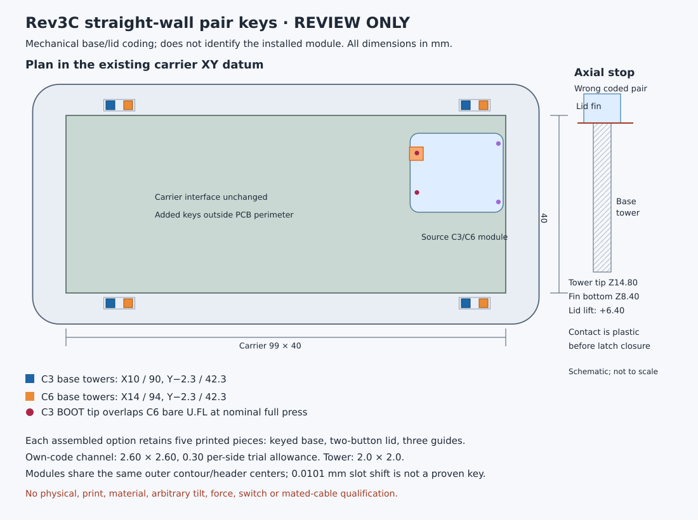

# Separate base/lid pair-key study

**Review option only. The current analytical common base remains the default.** A C3 lid can contact a C6 U.FL connector if the wrong module/lid is assembled. Labels and an explicit module check remain necessary.

The [preserved source and six review exports](REV3C-STRAIGHT-WALL-PAIR-OPTIONS-REVIEW-ONLY.zip) demonstrate integral C3- and C6-coded base/lid pairs. The archive is unchanged: SHA256 `a8aec5e25a908e47cb9cfdd1d456b296ac6e01b7f33b05cfea9887de21901246`, 5,368,284 bytes. It includes the frozen enclosure source, study scripts, dimension/closure receipts, exact STEP/STL models and manufacturer attribution. It contains no installed software or credentials.

All six STEP reimports are valid single solids. All six untouched STL meshes are watertight, consistently wound and positive-volume. All four matching module/antenna closures have zero nominal overlap. Both wrong directions contact at a 6.40 mm lid lift; 0.01 mm further insertion overlaps 0.160 mm³ while latch features remain 4.90 mm apart. This is aligned axial CAD evidence. Tilt, forcing, warp, print/material and actual assembly remain unqualified.

| Choice | Pieces per assembly | Effect and tradeoff |
| --- | ---: | --- |
| Existing common base and correct module lid | 5 | Module swaps retain the base. Procedure/label only; no mechanical mismatch prevention |
| Integral keyed base/lid pairs | 5 | Rejects the wrong **plastic pair** in the demonstrated approach. A module-family swap requires both base and lid; the actual installed module must still be checked |
| Common base with manual keyed insert | At least 6 | Extra item/step and wrong-setting risk; no safe automatic module discriminator authenticated |

The module outlines and fourteen header locations coincide. Their PCB slot registration differs by only about 0.0101 mm, insufficient evidence for a reliable passive module-sensing key. Populated switch/antenna parts must not become structural stops.

The archived pair-key options retain original fixed button reaches and the known 11.0 mm actuation limitation. They are not calibrated current-case print files. A chosen key scheme must be carried onto the explicitly parameterized current builder and independently rechecked before assembly. The archived study scripts also retain their original source-file paths: rebind the exact recorded manufacturer/source inputs before reproducing them; do not run them against arbitrary new files and reuse the old receipt.

Choosing a pair-key scheme changes the common-base swap contract, so it remains a deliberate design choice. No case variant has physical or RF qualification.
