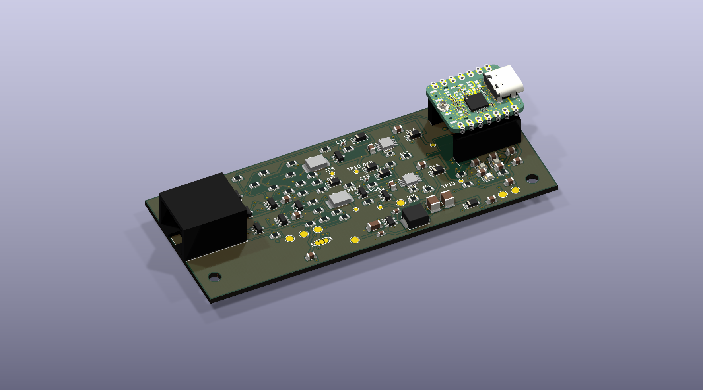
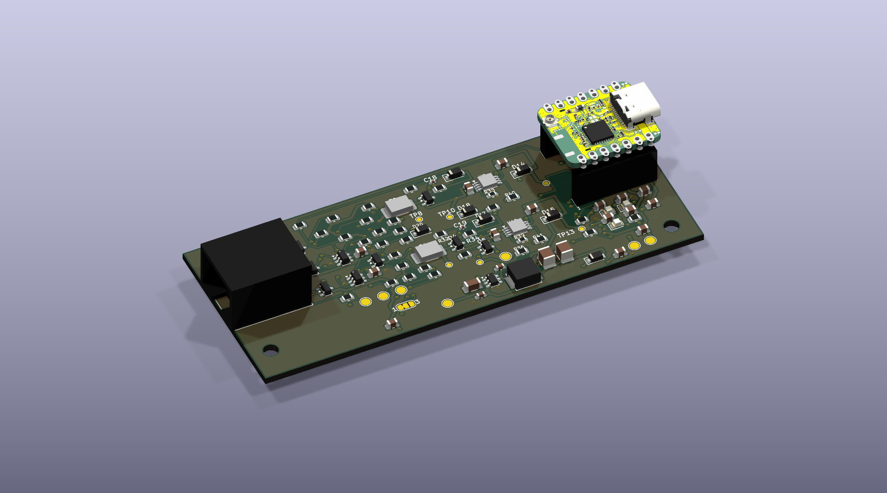
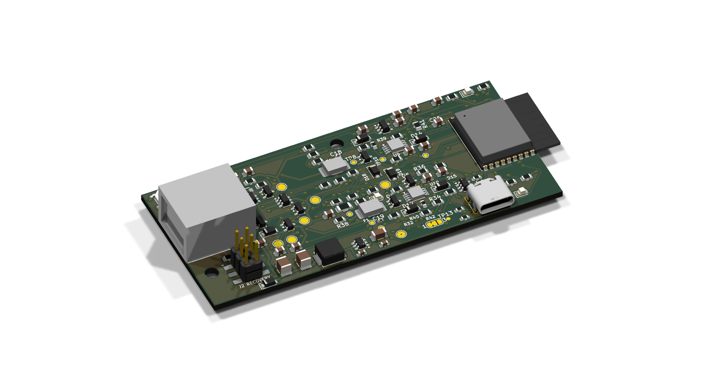
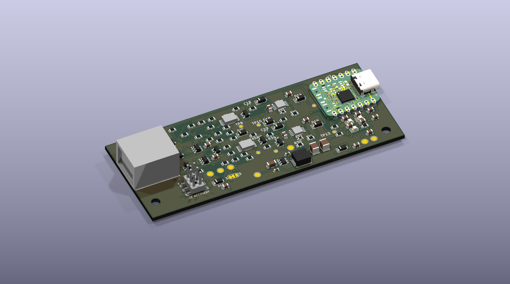
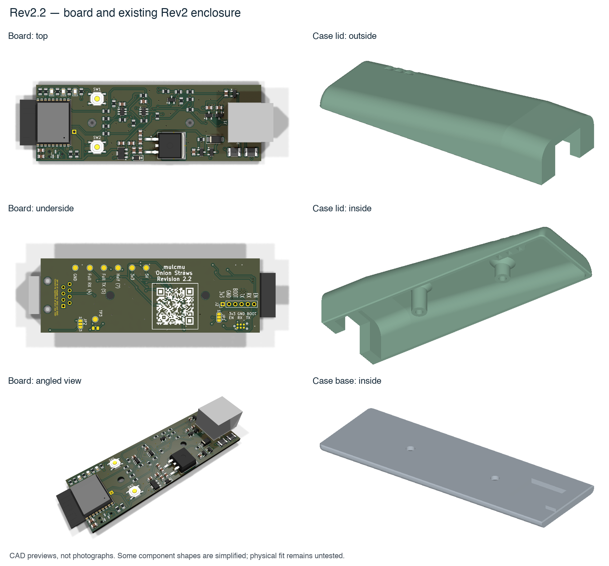
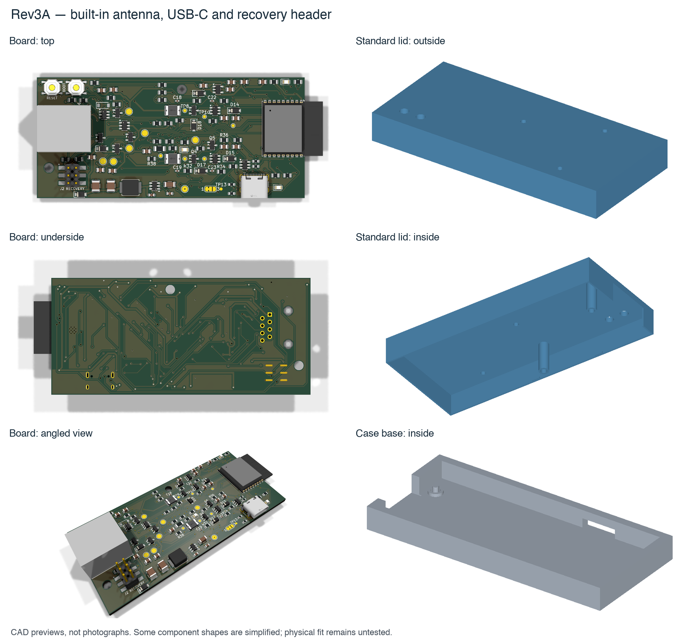
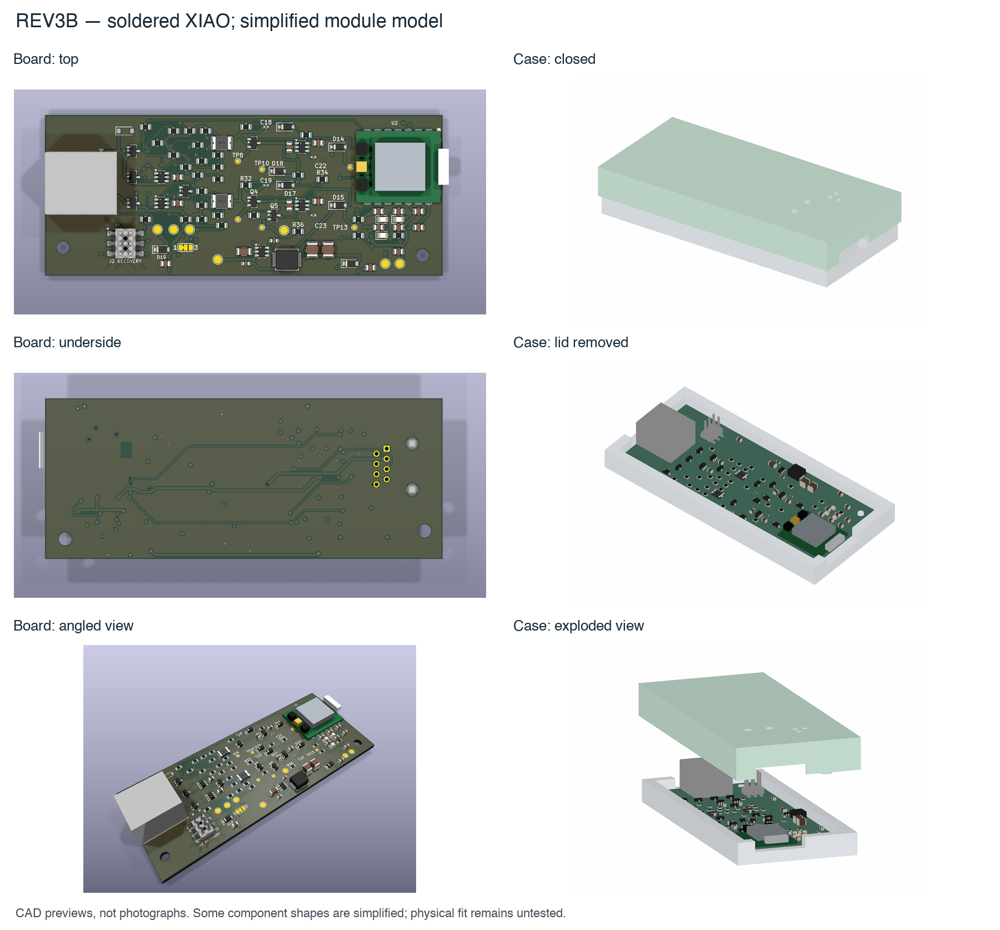
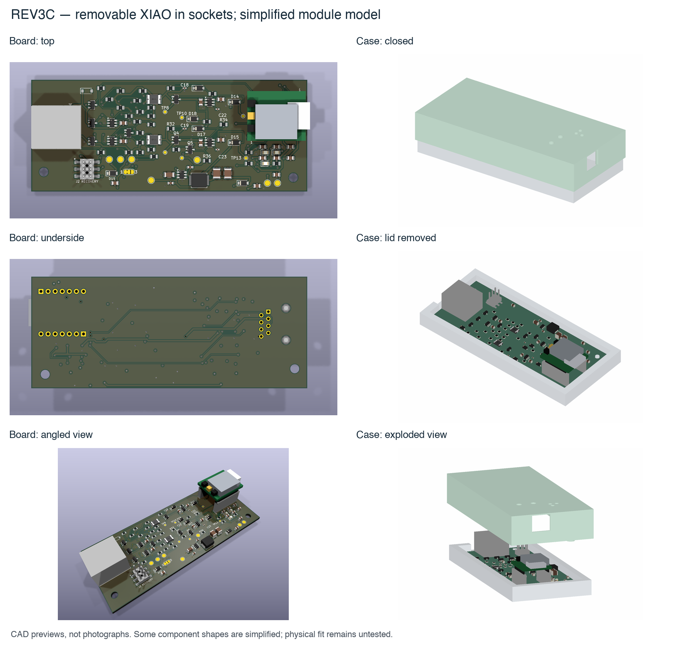

# Board and enclosure comparison

[Project overview](../../README.md) · [Current validation](VALIDATION.md) · [Pricing](PRICING.md) · [Finish plan](FINISH-PLAN.md) · [Source handoff](HANDOFF.md) · [C3/C6 and Matter](C6-MATTER.md)

Updated October 4, 2026 at 06:58 UTC; strict seven-revision native checks and exact source-bound quote snapshots. The user selected the shared Rev3C design with two **40 V-rated TPS1H200A switches**, both GE power inputs and automatic PIN1 priority. Current standalone source is `5542734`; its current factory trio is placement-corrected `b53cfca`. The original electrical protection source is `7bb455f`. Selection does not establish a 40 V carrier rating, appliance compatibility or manufacturing readiness.

C3 is the first target, with C6 interface and firmware flexibility retained. Rev3A/B backports are digitally reviewed at 97/85 fitted references; Rev3A rated protection, exact connector lands and zero-warning schematic normalization are independently reviewed and staged; all seven revisions now have zero native findings. Current-main-based per-revision candidates are staged locally. Older revisions retain their distinct architectures and review gates. No revision has physical qualification, and older boards are not established safe fallbacks.

## Architecture and current role

| Revision | Processor and service | Power architecture | Current role |
| --- | --- | --- | --- |
| Rev1.0 | Generic 38-pin classic ESP32 interface; original nodemcu-32s target | PIN1 only; external buck through J1 | Restored historical CAD and two new classic profiles; exact purchased module and external supply unknown |
| Rev2.0 | ESP32-C3-WROOM-02; UART programmer | Manual dual-input selector, linear 5 V and 3V3 regulators | Restored source; legacy protection, regulator and physical gates remain |
| Rev2.1 / Rev2.2 | ESP32-C3-WROOM-02; UART programmer | Manual dual-input selector, linear regulators | Native cleanup passes; 60 / 59 fitted references; source-specific placement review remains |
| Rev3A | Integrated C3 and built-in antenna; carrier USB-C/recovery controls | Automatic dual input and buck; separate USB/appliance paths | Rated backport and zero-finding native checks complete;97 refs, exact current quote; source/process/physical gates open |
| Rev3B | Soldered XIAO C3; module USB-C/external antenna | Automatic dual input and buck | Rated protection passes native/manufacturing/intended-rule checks ; 85 fitted refs; soldered C3 sourcing/install and physical gates open |
| Selected Rev3C | Socketed pre-headered XIAO C3/C6; module USB/BOOT/RESET | Both GE inputs, automatic PIN1 priority, rated switches and buck | Selected development source; 83 fitted carrier references; four shared C3/C6 firmware builds |

Rev3B/C require one physical power source at a time because the module's side-header VBUS connects to USB VBUS. Disconnect appliance power before powered USB. Rev3A's separate isolation paths still require bench verification. UART programmer VCC remains disconnected. Selection of C6 does not remove these power-path limits.

## Current quote comparison

USD, complete PCB plus Economic top-side assembly, with all carriers assembled. The selected quote refreshed October 4 at 04:16 UTC includes the selected exact parts, RJ45 and female sockets. Shipping, tax, separately purchased XIAO modules/headers, installation, programming, tests and cases are excluded.

| Matched Rev3C source | Fitted references | Five carriers | Ten carriers |
| --- | ---: | ---: | ---: |
| Selected current factory trio `b53cfca` | 83 | **$134.64** | **$168.91** |
| Historical clamp-sourced baseline `ca1fdb1` | 80 | $130.39 | $160.37 |
| Selected design premium | +3 | **$4.25** | **$8.54** |

The premium is about $0.85 per carrier. These are quote observations, not an order or delivered cost. Older architecture prices and module snapshots are clearly separated in [PRICING.md](PRICING.md). Current A includes its processor at $178.90/5 or $227.86/10; B remains stock-blocked. The selected source contains the illustrated `pcb/rev3c/ORDERING.md` and matching relative assets; use that guide only with its exact three-file package.

## Current source-bound C3/C6 package previews

These October 4 previews accompany selected standalone source `5542734`. Official Seeed C3 v1.3/C6 v1.0 PCB geometry and licensed generic packages replace the earlier module block. The bare C3/C6 SoC packages are dimension-checked5 ×5 ×0.85 mm nominal with reviewed pin 1 orientation. Complete manufacturer assembly CAD, button/regulator exact heights, header seating and physical case fit remain unverified. The earlier galleries below are retained historical views.

The carrier PCB/schematic/manufacturing/firmware bytes are unchanged by these visual additions. Model source/provenance and its exact-source preservation receipts live in the selected candidate's `pcb/rev3c/MODEL-ACCURACY.md` and `validation/`. Module antenna/pigtail, exact buttons and mating geometry are not qualified by these views.

### Current alternative board previews

These are source-bound CAD previews of the reviewed alternatives, not manufactured boards. A preserves its integrated C3 architecture; B uses the partial native-registered C3 v1.3 model with unmeasured solder seating. Actual package/process/case/RF/thermal fit remains unqualified.

## How to read the historical images

These are historical CAD previews, not photographs of manufactured boards or views of the selected source. They show
the populated-board layout and case geometry from several angles. Common
parts use KiCad package models; the RJ45 body and XIAO module use simplified
clearance models. The XIAO shield outline is approximate, and the antenna
cable and flat antenna are omitted. Rev2.2's fuse bodies use an 1812-package
stand-in whose exact height is unverified. Colors are illustrative.

These galleries are the published October 2 source views. New cleanup packages
carry their own matched exports; do not pair old galleries with changed factory
files. The images help compare layouts but do not establish connector fit, socket
retention, thermal performance or RF reception. Rev2.2 and Rev3A show base
and lid separately. Rev3B/C include assembly previews and exploded views;
the exploded lid offset is for presentation.

### Rev2.2 and the existing Rev2 case

Board: [top](images/rev2.2/board-top.png) · [bottom](images/rev2.2/board-bottom.png) · [angled](images/rev2.2/board-oblique.png) · [side](images/rev2.2/board-side.png).

Case: [base inside](images/rev2.2/case-base-inside.png) · [base side](images/rev2.2/case-base-side.png) · [lid outside](images/rev2.2/case-lid-outside.png) · [lid inside](images/rev2.2/case-lid-inside.png).

Source: [Rev2.2 PCB](https://github.com/Dr-Crow/esphome-ge-laundry-uart/tree/bc0d52495bd97ed1504bd0ca0775e47feb01a648/pcb/rev2.2) · [Rev2 case](https://github.com/Dr-Crow/esphome-ge-laundry-uart/tree/bc0d52495bd97ed1504bd0ca0775e47feb01a648/case/rev2).

### Rev3A

Built-in antenna, separate USB-C connector, BOOT/RESET buttons and recovery
header. The gallery shows the standard tool-access lid; a separate optional
finger-button lid is available in the source branch.

Board: [top](images/rev3a/board-top.png) · [bottom](images/rev3a/board-bottom.png) · [angled](images/rev3a/board-oblique.png) · [side](images/rev3a/board-side.png).

Case: [base inside](images/rev3a/case-base-inside.png) · [base side](images/rev3a/case-base-side.png) · [lid outside](images/rev3a/case-lid-outside.png) · [lid inside](images/rev3a/case-lid-inside.png).

Source: [Rev3A PCB](https://github.com/Dr-Crow/esphome-ge-laundry-uart/tree/a5a9fac87cbcb59d337a1fb8d3084ad18867a3e6/pcb/rev3a) · [Rev3A case and optional button lid](https://github.com/Dr-Crow/esphome-ge-laundry-uart/tree/a5a9fac87cbcb59d337a1fb8d3084ad18867a3e6/case/rev3a).

### Rev3B

XIAO soldered to the carrier. Its module is lower than Rev3C's removable
version. BOOT and RESET are on the XIAO itself; J2 remains inside the case.

Board: [top](images/rev3b/board-top.png) · [bottom](images/rev3b/board-bottom.png) · [angled](images/rev3b/board-oblique.png) · [side](images/rev3b/board-side.png).

Case: [closed](images/rev3b/case-closed.png) · [side](images/rev3b/case-side.png) · [lid removed](images/rev3b/case-open.png) · [exploded](images/rev3b/case-exploded.png).

Source: [Rev3B PCB](https://github.com/Dr-Crow/esphome-ge-laundry-uart/tree/c5db989810663caa18226a091bfb105ad26fb00e/pcb/rev3b) · [Rev3B case](https://github.com/Dr-Crow/esphome-ge-laundry-uart/tree/c5db989810663caa18226a091bfb105ad26fb00e/case/rev3b).

### Public C3-only Rev3C baseline and legacy case

The pre-headered XIAO plugs into factory-installed female sockets. This
requires a taller case but permits replacing the module without soldering.
The case shown below is **C3-only legacy**, not a default shared C3/C6 enclosure.
The separately explored five-piece common enclosure remains an unqualified concept;
its exact final CAD is unavailable and must be restored before source and fit review. C6 buttons, antenna access,
module retention and physical fit require their own checks.

Board: [top](images/rev3c/board-top.png) · [bottom](images/rev3c/board-bottom.png) · [angled](images/rev3c/board-oblique.png) · [side](images/rev3c/board-side.png).

Case: [closed](images/rev3c/case-closed.png) · [side](images/rev3c/case-side.png) · [lid removed](images/rev3c/case-open.png) · [exploded](images/rev3c/case-exploded.png).

Source: [Rev3C PCB](https://github.com/Dr-Crow/esphome-ge-laundry-uart/tree/38d94d3dc7c41692e3c41710ec33b9f6e0c38b3e/pcb/rev3c) · [Rev3C case](https://github.com/Dr-Crow/esphome-ge-laundry-uart/tree/38d94d3dc7c41692e3c41710ec33b9f6e0c38b3e/case/rev3c).

## Package scope

This branch updates comparison and finish-plan documentation only. Its historical galleries are retained with their original public-source links. Current native results and exact unpublished heads are in [VALIDATION.md](VALIDATION.md) and [HANDOFF.md](HANDOFF.md); the remaining work is tracked in [FINISH-PLAN.md](FINISH-PLAN.md).
