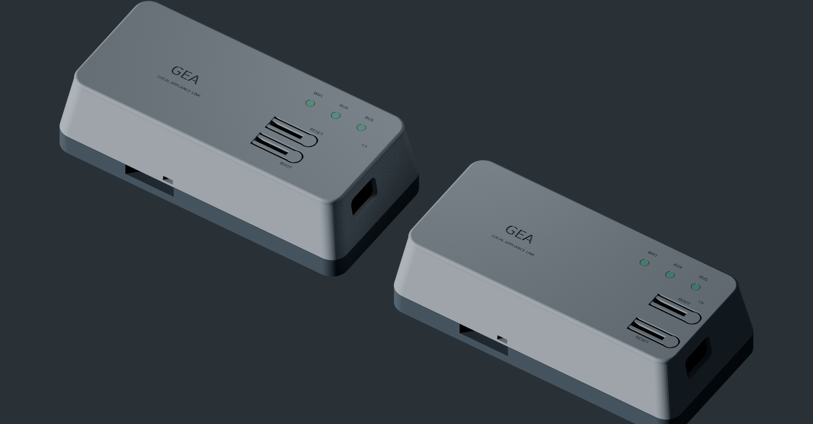

# All-revision pre-order review

Updated October 5, 2026. Rev3C remains the selected design: both appliance PIN1/PIN3 inputs, automatic PIN1-presence priority, two 40 V TPS1H200A switches, AP63205 buck and socketed C3/C6 options. Source histories and earlier variants are preserved. No order, upstream submission or physical qualification is included.

**Current development scope is Rev3A, Rev3B and Rev3C, with Rev3C first.** Rev2.2 was merged upstream in [PR18](https://github.com/mulcmu/esphome-ge-laundry-uart/pull/18) on September 22, 2026 at [`bc0d524`](https://github.com/mulcmu/esphome-ge-laundry-uart/commit/bc0d52495bd97ed1504bd0ca0775e47feb01a648). This was verified read-only on October 5. No new Rev1/Rev2.x redesign is planned. Their existing committed fixes, source history and unresolved qualification findings remain reference evidence.

## Verified digital checkpoint

Published `77f4c8893db6c018640e25c55a3af624a3eb06b3` passes [strict native hardware](https://circleci.com/gh/Dr-Crow/esphome-ge-laundry-uart/99), [intended rules](https://circleci.com/gh/Dr-Crow/esphome-ge-laundry-uart/97), [38 validator tests](https://circleci.com/gh/Dr-Crow/esphome-ge-laundry-uart/101) and [all eight firmware builds](https://circleci.com/gh/Dr-Crow/esphome-ge-laundry-uart/96). Native checks use pinned KiCad 9.0.9 with all severities, expanded track reporting and schematic parity. All seven revisions have zero reported native findings at that checkpoint. The native job also generates 21 current schematic/top/mirrored-bottom review files and seven receipts; their artifact listing and generation guard were verified, but independent hosted-content readback was browser-blocked. Further source changes require their own exact-head checks.

Source/CAM parity covers seven boards; complete supplier BOM/CPL parity covers five. Rev1.0/Rev2.0 lack qualified current supplier pairs. Inventory, manufacturing and release checks remain intentionally red for those gaps and the 21 explicit power/source/physical gates. A configured/native pass is not a release approval.

## Every revision, with a distinct outcome

| Revision | New work and source consistency | Firmware | Purchasing and quote | Remaining pre-order decision or evidence |
| --- | --- | --- | --- | --- |
| Rev1.0 | Explicit BOM exclusion for board holes/test pads; already-DNP R1 now formally flagged; original electrical geometry preserved | Classic GEA2/GEA3 compile; physical devboard identity unresolved | No qualified current pair; capacitor/package, fuse, R5 and population alternatives unresolved | Exact 22.86 mm-row devboard and external buck; choose the intended assembly variant and rated parts. Official DevKitC's 25.40 mm rows are incompatible |
| Rev2.0 | R18/R21 procurement corrected to 220 kΩ, R22 to 4.7 kΩ; holes excluded; exact AP2205 documentation | Root C3 GEA2/GEA3 compile | Current supplier pair absent; D8 C2993047 identity unresolved; historical archives preserved | Review a complete rated supply/protection repair, fitted-U1 reset behavior and exact parts/placements |
| Rev2.1 | Same three resistor corrections; exact regulator documentation; 60-ref pair and source CAM retained | Root C3 GEA2/GEA3 compile | Current 60 refs/24 codes match. U6 stock 4, short 1 at five /6 at ten; full assembly total unavailable. Bare PCB $5.30/$6.40, including deburring | 200 mA regulated supply versus ≥500 mA module provision; fuse, linear heat, gate/cap/TVS coordination and U1 behavior remain unqualified |
| Rev2.2 | Exact TECH PUBLIC 200 mA regulator documentation; original DNP choices preserved; 59-ref pair | Root C3 GEA2/GEA3 compile | Historical $78.07/five remains a dated comparison, not a fresh stock quote | Same rated-capability/protection/thermal limits; manufacturer pin-table typo and assembly/stencil review |
| Rev3A | Rated dual-input backport and corrected USB shell lands retained; complete Murata ordering identity; 97-ref pair | Root C3 GEA2/GEA3 compile | $178.90/five, $227.86/ten at the recorded October 4 freeze, including module | AP2112/USB-fuse thermal and loaded margin; recessed J4 shell solder/retention process, supplier pose and actual source limits |
| Rev3B | Rated dual-input backport retained; exact Murata identity; 85-ref pair and typed module/body datums | Shared XIAO C3 GEA2/GEA3 compile | JLC exact module stock blocked. Same bare 113991054 has Seeed/DigiKey sourcing routes, with lot/process checks | Approve exact header-free v1.3 module/assembly; C6 is not a soldered drop-in. Source, heat, low-input and supplier pose remain unqualified |
| **Rev3C** | Selected rated design, corrected paste markers/J1 CPL and complete Murata identity; 83-ref pair unchanged | C3/C6 ×GEA2/GEA3 compile | Fresh October 5 exact carrier quote: **$134.64/five /$168.92/ten**, no substitutions; modules/headers/case excluded | OEM envelope, loaded supply/heat/fault qualification, supplier placement/stencil review and the specific case dimensions below |

Prices are USD, exclude shipping/tax and are not reservations or purchase approvals. Integrated A/module-included prices are not directly comparable with C's carrier-only subtotal. [Quote detail](../PRICING.md) and [selected ordering guide](../../../pcb/rev3c/ORDERING.md) retain exact file/hash/settings boundaries.

## Purchasing correctness and source fixes

The current five supplier BOMs contain 53 distinct non-module codes, with 23 passive identities. The [catalog ledger](nonmodule-catalog-ledger.csv) records their selected values, revisions, primary catalog links and remaining rating/geometry/stock limits. Rev1 generic selections and Rev2.0 D8 are separately unresolved. The new [independent catalog table](../../../ci/passive-catalog.json) verifies R/C/L value and package, available MPN, and explicit capacitor voltage/dielectric. Negative tests reject the actual old 200 kΩ/47 kΩ mappings, incompatible capacitor declarations, unknown codes and stale source metadata. This closes a gap that source/BOM parity alone missed. It does not certify land patterns, stock, effective capacitance or thermal behavior.

The three resistor choices follow the declared network, manufacturer ratings/package evidence and the historical Rev2.2 intended-part correction. [Intent review](legacy-intent/GE-Legacy-Resistor-Intent-Review.md), [exact metadata delta](../legacy-metadata-correction.json), [Rev2.1 code delta](../../../pcb/rev2.1/validation/purchasing-code-correction.json) and [Rev2.0 code delta](../../../pcb/rev2.0/native-review/purchasing-code-correction.json) preserve source boundaries and historical conflicting archives. Modern C161181 still selects the same part; its complete Murata MPN ends in D.

The legacy BAV99 hidden names are stale; numbered terminals and the actual drawing govern polarity. C78479 is nominal BZT52B5V1: its 5.00–5.20 V range is specified at 5 mA/25 °C. A legacy `5.2V` label is not a guaranteed operating clamp. No diode or circuit is silently substituted. Rev1 generic parts and Rev2.0 D8 remain explicitly unidentified.

## Completed power analysis and limits

[All-seven power analysis](power/GE-All-Revision-Power-Margin-Review.md) independently checks every numbered power/USB path and actual PCB net membership, with zero physical membership differences. It includes 59 conditional voltage/derating rows, exact capacitor rail locations and separate C3/C6 module paths. The C3 TLV757 linear path and C6 SGM6029 buck path are distinct.

Characterized RF points are C3 chip 335 mA, WROOM 345 mA and C6 chip 354 mA under their published conditions. The all-LEDs-on carrier example adds20.626 mA on 3V3 and1.033 mA on 5 V. These are transparent estimates, not measured or guaranteed whole-board maxima. The separate500 mA stress case is not normal-load evidence.

Nominal5 V input headroom remains conditional because complete maximum series losses, OEM tolerance/impedance and transient load are missing. A below-target3.3 V rail is not automatically below the chip's3.0 V minimum. No field failure is inferred. The 40 V switch is not a40 V carrier rating: PMOS, buck, fuse, TVS pulse/current and thermal limits remain distinct.

Legacy2.x's200 mA regulators do not establish the manufacturer's ≥500 mA supply provision. Increasing only the3V3 LDO leaves0.3 A input-fuse capability, L7805 heat and unclamped gates/25 V input-cap coordination unresolved. A complete repair needs a reviewed supply/protection approach; the original manual-selection architecture is preserved until then. A/B/C share the rated switch backport, but their module/USB/thermal budgets remain separate.

These calculations use documented formulas and explicitly mixed/typical/reference conditions. No full-chain SPICE or physical simulation is claimed. [Module source limits](power/module-power/GE-XIAO-Module-Power-Evidence.md), [legacy limits](power/legacy-power/GE-Legacy-Power-Limits-Review.md) and [exact alternate-vendor/module review](module-sourcing/GE-Exact-Module-Sourcing-Review.md) provide the detailed evidence.

## Actual enclosure progress

The [editable analytical derivative](../../../case/rev3c/analytical/README.md) registers current component bounds and samples installed stack 11.0–11.65 mm. It includes calibrated per-button dimensions, a separately reviewed longer C3 leaf, locally relieved light guides and an explicit five-piece exporter. The recovered original source stays unchanged. Native source-derived renders show real BOOT/RESET/module labels; their materials are illustrative.

Original fixed reaches do not contact at the11.0 mm stack. Per-assembly parameters produce conditional contact depression; actual electrical make and safe overtravel are unknown. The common closure permits wrong lids, and a C3 foot can intersect the C6 U.FL screen. Labels are not a physical interlock.

The [USB corridor study](../../../case/rev3c/analytical/review/USB-OPENING-REVIEW.md) distinguishes an opening from internal insertion clearance. A wider16×10 mm study remains unadopted: C6's assumed full body corridor still intersects supports, including the12×6 mm gauge. Choose an actual cable's mating axis, shank, overmold and strain-relief envelope before changing supports. Maximum cap relief preserves the nominal LED inlet and roof retention, with reduced area requiring optical/print checks. Antenna cable/mating, bulkhead tolerance and material/fatigue remain specific open gates.

## What can happen next

1. Continue narrowly supported electrical and mechanical repairs across Rev3A/B/C. Preserve each revision's module, USB and power architecture; the selected dual-input/automatic-priority behavior remains required. Use the [Rev3 follow-up map](REV3-FOLLOW-UP.md) to distinguish actual defects, conditional analyses and choices.
2. Keep the selected C3-first/C6-flexible Rev3C prototype. Authenticate module/header, switch and USB cable envelopes and resolve wrong-lid prevention. [Pinned CAD reproduction](../../../case/rev3c/analytical/review/pinned-reproduction/GE-Pinned-CAD-Reproduction-2026-10-05.md) is now complete at the frozen 77f4c88 source: 51 export pairs pass and20 engine comparisons agree. It does not qualify actual printed or installed hardware.
3. Keep Rev1/Rev2.x as historical references. Do not extend the new power redesign into those upstreamed or historical revisions. Their existing risk and source records remain visible; they are not qualified fallbacks.
4. After the pre-order analytical work, use controlled unpowered assembly/print coupons, then a separately reviewed current-limited test procedure for both inputs, priority, startup/RF, protection/retry, thermal, bus and recovery. Identify the appliance/model first. No physical test has occurred.

Leave UART VCC disconnected. Use one reviewed input supply. Disconnect the appliance cable before powered USB on XIAO carriers. Firmware examples do not identify an unconfirmed refrigerator or guarantee its ERDs. No orders or upstream changes follow from this report.
