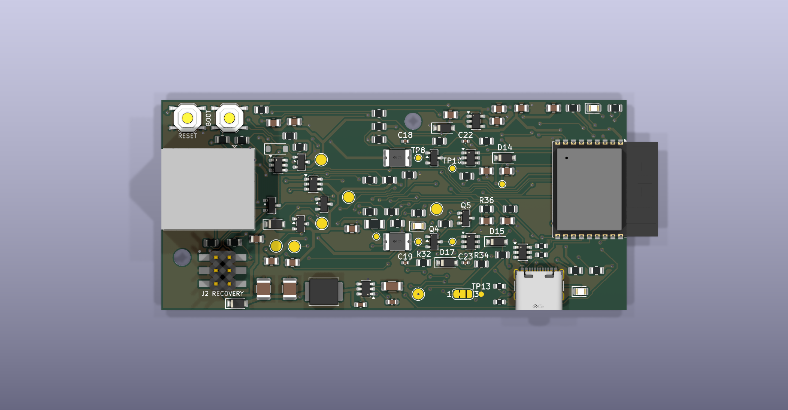

# Revision 3A board guide

Revision 3A keeps the ESP32-C3-WROOM-02 module and its built-in Wi-Fi antenna,
then adds USB-C, automatic appliance-power selection, clearer controls, status
indicators, and a permanent recovery header.

> **Prototype status:** this design has not been electrically qualified. Do not
> connect it to an appliance until a small assembled batch passes the
> current-limited checks in [BRINGUP.md](BRINGUP.md).

The render is oriented with the appliance connector on the left, the ESP32
antenna at the right edge, and USB-C along the lower edge.

## Controls, connectors, and indicators

| Marking | What it is | Normal use |
| --- | --- | --- |
| `J1` | Appliance 8P8C connector | Connects power and the GEA serial bus after prototype qualification. |
| `J4` | USB-C | Normal flashing, serial logging, and bench power. |
| `J2 RECOVERY` | 2-by-3, 2.54 mm header | Backup 3.3 V UART flashing if native USB is unavailable. Open the enclosure before use. |
| `SW1 RESET` | Reset button | Restarts the ESP32-C3; reachable through the matching lid service hole. |
| `SW2 BOOT` | Boot-mode button | Hold while resetting to force the ROM downloader; reachable through the matching lid service hole. |
| `D4` green | Wi-Fi indicator | Firmware-controlled indication that Wi-Fi is connected. |
| `D6` yellow | GEA-bus indicator | Firmware-controlled indication that the appliance bus is connected. |
| `D5` red | Diagnostic indicator | User-controlled diagnostic light; a fault pattern is reserved for future firmware. |
| `U2` | ESP32-C3-WROOM-02 | Runs ESPHome and includes the Wi-Fi radio and antenna. |

The ESP32 antenna projects beyond the right board edge. Keep at least 15 mm of
clear space beyond that edge; do not place metal, wiring bundles, or enclosure
hardware in that volume.

The printable lid has two small service holes above RESET and BOOT and three
separate viewing apertures above the green, red, and yellow LEDs. J2 remains
inside the enclosure because recovery leads should never remain attached during
normal appliance operation.

## How appliance power works

Different appliance harnesses can supply power on J1 pin 1 or pin 3. Rev3A does
not require a user jumper:

- each input has its own resettable fuse and reverse-polarity protection;
- the control circuit gives pin 1 priority when both inputs are present;
- blocking diodes are intended to prevent either appliance pin from feeding the
  other input;
- USB power is isolated from appliance power before the board's rails join.

Those are design objectives, not proven safety claims. Bring-up must measure all
eight pin-1, pin-3, and USB presence combinations before an appliance is used.

## Normal flashing

1. Leave J1 disconnected during initial bench work.
2. Connect J4 to a computer with a USB-C data cable.
3. Flash through the ESP32-C3 native USB interface.
4. If automatic download mode does not start, hold `SW2 BOOT`, tap and release
   `SW1 RESET`, then release `SW2 BOOT` after the downloader starts.

## Recovery flashing through J2

J2 is a backup for a damaged or unavailable USB data path. Use a **3.3 V logic**
USB-to-UART adapter and female Dupont leads. Never apply 5 V logic to J2, and
never drive J2 power while J1 or J4 already powers the board. The exact pin map
and recovery sequence are in
[BRINGUP.md](BRINGUP.md#recovery-flashing-when-usb-is-unavailable).

## Where to go next

- [README.md](README.md): architecture, changes from Revision 2.2, and release gates.
- [DESIGN_NOTES.md](DESIGN_NOTES.md): engineering decisions, tradeoffs, and unresolved risks.
- [BRINGUP.md](BRINGUP.md): bench equipment, test sequence, and result tables.
- [review/README.md](review/README.md): schematic, layer, assembly, 3D, ERC, DRC, and drill-review package.
- [production/README.md](production/README.md): Gerber, BOM, CPL, and quote-package details.
- [case/rev3a/README.md](../../case/rev3a/README.md): enclosure dimensions and connector clearances.
