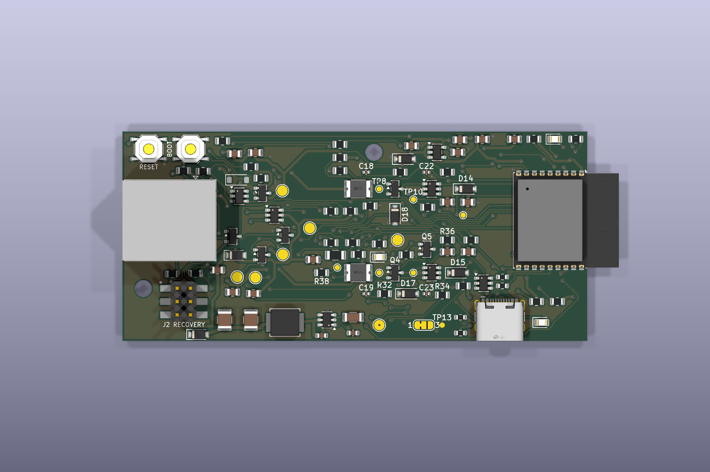

# Revision 3A validation package

The KiCad source in [`../design/`](../design/) is authoritative. These review
artifacts are generated from that source and must be refreshed after a design
change. Rev3A remains an unqualified prototype until the physical gates below
pass on at least two assembled boards.

## Review artifacts

| Artifact | Purpose |
| --- | --- |
| [`schematic.pdf`](schematic.pdf) | Light-background, grid-free schematic |
| [`../images/top.svg`](../images/top.svg) / [`../images/bottom.svg`](../images/bottom.svg) | Outer copper and silkscreen views; bottom is mirrored |
| [`../images/inner1.svg`](../images/inner1.svg) / [`../images/inner2.svg`](../images/inner2.svg) | Individual internal-layer views |
| [`assembly-top.pdf`](assembly-top.pdf) / [`assembly-bottom.pdf`](assembly-bottom.pdf) | Fabrication outlines and reference designators |
| [`board-outline.pdf`](board-outline.pdf) | Board outline and hole locations |
| [`../images/3d-top.png`](../images/3d-top.png) | Straight-down populated-board view |
| [`../images/3d-isometric.png`](../images/3d-isometric.png) | Connector and component-height view |
| [`../images/3d-bottom.png`](../images/3d-bottom.png) / [`../images/3d-side.png`](../images/3d-side.png) | Underside and side clearances |
| [`pth-drill-map.pdf`](pth-drill-map.pdf) / [`npth-drill-map.pdf`](npth-drill-map.pdf) | Plated and non-plated hole review |

The machine-readable `erc.json` and `drc.json` snapshots were stale generated
outputs and have been removed. Regenerate checks from the current KiCad source
when validating a new revision.

## Automated-check results and warning dispositions

KiCad 9.0.9 reports zero ERC errors and 53 warnings; DRC reports zero errors,
seven warnings, zero unconnected items, and zero schematic-parity findings.

- ERC: 44 warnings are embedded-symbol/library differences, eight are USB-section
  grid warnings, and one is the intentional `+5V`/hidden-`VCC` alias. Recheck
  symbols, USB geometry, and the power alias after any source edit.
- DRC: five warnings are retained local-footprint differences and two are
  antenna-silkscreen edge warnings. Confirm each remains intentional in the
  current run.
- The short D18 connection on `In2.Cu` is intentional and passes DRC. `In1.Cu`
  is the continuous USB ground reference; do not describe both inner layers as
  uninterrupted planes.

## Independent review focus

An independent reviewer should keep schematic, layout, BOM, and mechanical
findings separate and specifically check:

1. J1 pinout, pin-1 priority, reverse-current isolation, fuses, TPS22810/load
   switches, Schottky ORing, D18 polarity/rating, USB-C CC/ESD/VBUS isolation,
   J2 recovery, reset/boot, and DNP items.
2. USB routing, layer transitions, continuous `In1.Cu` return, switching loops,
   feedback route, power widths, antenna keepout, silkscreen, drills, and
   enclosure clearances. No controlled-impedance claim is made.
3. Every BOM manufacturer/part identifier, package, polarity, rating, pin
   mapping, placement rotation, and substitution against the source.
4. Fabricator stack-up and vendor board, drill, part-selection, and placement
   previews, separately from the KiCad ERC/DRC run.
5. The J1 3D model as a conservative envelope; final connector fit requires a
   real part.

## Release and physical gates

- [x] Grid-free schematic, top/mirrored-bottom/inner views, assembly drawings,
  populated renders, outline and drill maps are present.
- [x] Matched Gerber, BOM, and placement files are present; the accepted planning
  package contains 40 BOM groups and 93 top-side placements.
- [x] Source-to-PCB parity has no mismatch; ERC/DRC have no errors or unconnected
  items, with warnings dispositioned above.
- [x] Standard 0.8/0.4 mm routed through-vias, 0.30 mm ESP32 thermal drills,
  top-side assembly, and the `In1.Cu`/D18 `In2.Cu` exception are documented.
- [ ] Independent datasheet pinout, polarity, land-pattern, schematic, PCB, BOM,
  and enclosure review completed.
- [ ] Fabricator stack-up and USB return path reviewed; vendor previews reviewed.
- [ ] Prototype batch assembled and visually inspected.
- [ ] Actual appliance supply range and AP63205 headroom measured.
- [ ] Pin-1-only, pin-3-only, all eight source combinations, and both dynamic
  handoff directions pass without dropout, cross-feed, or unsafe heating.
- [ ] Reverse current into inactive appliance inputs meets the reviewed limit.
- [ ] USB VBUS falls below 0.8 V within one second after removal and no
  appliance-to-host backfeed is observed.
- [ ] D18 stand-off, clamp behavior, and energy margin match measured conditions.
- [ ] USB enumeration, flashing, reconnect, sustained logging, and Wi-Fi-load
  tests pass.
- [ ] Enclosure fit, connector insertion, button access, LED visibility, and
  installed antenna performance pass.

Do not order more than a small prototype batch or connect an appliance until all
physical items pass on at least two boards. Keep USB disconnected for the first
appliance-only test; test appliance plus USB only after that test passes.

## Review order

1. Review the schematic and power/protection questions above.
2. Check layout, return paths, clearances, silkscreen, drills, and enclosure.
3. Confirm BOM parts, footprints, polarity, ratings, and rotations.
4. Run ERC and DRC from the current source and re-check warning dispositions.
5. Review vendor board, drill, part-selection, and placement previews separately.

The detailed bench sequence, J2 pin map, eight-state matrix, D18 test, stop
conditions, and result-recording fields are maintained in the [Rev3A README](../README.md#prototype-bring-up).
