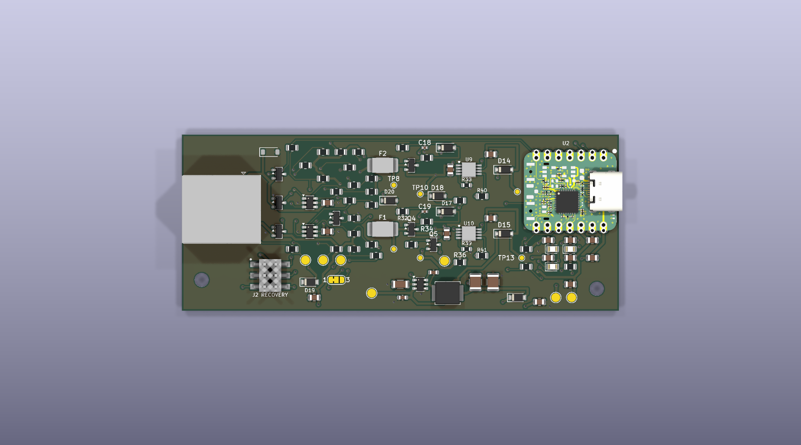

# PCB Rev 3B review candidate

Rev 3B is a routed design under review with a bounded rated-protection backport. It passes KiCad 9's PCB and schematic checks, and manufacturing files are available for review and quoting. It is not ready to order. The [PCB revision index](../README.md) distinguishes this prototype from the retained historical designs; none is an appliance-qualified fallback.

[Back to the PCB revision index](../README.md) · [Historical ordering guide](../ORDERING.md)

## What Rev 3B is

Rev 3B uses a Seeed XIAO ESP32-C3 module with built-in USB-C, BOOT/RESET buttons, and an external antenna. It follows the approach of the [FirstBuild GE appliance adapter](https://github.com/geappliances/home-assistant-adapter). Rev 3A instead uses an ESP32-C3-WROOM-02 module and a separate USB connector on the carrier.

The antenna comes with the XIAO module; factory installation still needs confirmation. The carrier footprint follows Seeed's official 22-pad drawing.

The [KiCad 9 project](design/GEA-Adapter-Rev3B.kicad_pro), [schematic source](design/GEA-Adapter-Rev3B.kicad_sch), and [PCB source](design/GEA-Adapter-Rev3B.kicad_pcb) are available for design review. The provisional PCB uses four copper layers and measures 99 x 40 mm, with USB-C extending about 1 mm beyond the edge. This is 10.3 mm longer than Rev 3A's PCB; the extra space accommodates the XIAO, a deliberate functional-block layout, and mounting supports at opposite board ends.

The current rated-protection KiCad 9.0.9 audit reports zero configured PCB errors, warnings, excluded findings, unconnected items or schematic-to-board mismatches with all severities and all track errors requested. The schematic check also reports zero errors, warnings and excluded findings. The [rated-protection review](RATED-PROTECTION.md), [gate-clamp review](GATE-PROTECTION.md), [B-specific loaded-power gates](POWER-QUALIFICATION.md) and [frozen implementation proof](validation/rated-protection-proof.json) and [current metadata proof](validation/delay-pin-type-proof.json) record the exact backport and refreshed exports. The [earlier source audit](validation/SOURCE-REVIEW.md) describes frozen pre-backport B. The board uses ordinary 0.8 mm vias with 0.4 mm drills, keeps vias off surface-mount solder pads, and reserves the first inner layer for ground. Passing these checks does not establish electrical, thermal or appliance compatibility on assembled hardware.

The J2 model now matches the supplier drawing's pin arrangement and seating orientation. The XIAO preview now uses the licensed official C3 v1.3 PCB-derived partial model with a dimension-checked nominal SoC; the RJ45 remains a clearance envelope. [Model accuracy and datum notes](MODEL-ACCURACY.md) record the unchanged soldered-carrier placement, unmeasured nominal seating height and omitted geometry. Physical seating, enclosure fit, power-input limits and prototype testing remain to be checked. These files are not a fabrication release.

## Board views

[Top](images/rev3b-render-top.png) · [Bottom](images/rev3b-render-bottom.png) · [Angled view](images/rev3b-render-oblique.png)

Copper layers: [top](images/rev3b-copper-f-cu.svg) · [inner ground](images/rev3b-copper-in1-cu.svg) · [inner routing](images/rev3b-copper-in2-cu.svg) · [bottom](images/rev3b-copper-b-cu.svg). All copper plots use the top-side viewing direction so layers can be compared; the bottom 3D view looks from underneath.

## One power source at a time

Rev 3B is not appliance-qualified. The supported appliance voltage range, startup and transient behavior, and loaded module power rails still need verification on a controlled bench prototype. Do not connect this unqualified board to an appliance.

Rev 3B retains a candidate circuit intended to automatically select between GE appliance pin 1 and pin 3 power without a solder-selector change. Correct operation, polarity protection, transient coordination and loaded startup from either wiring remain unverified; the [source review](validation/SOURCE-REVIEW.md#electrical-release-gates) explains the separate gates. Both original appliance inputs and the automatic selection circuitry remain present. The current candidate uses exact TPS1H200A switches, source-referenced MCC clamps, 33 V Littelfuse PPTCs and a matching PIN3 TVS. These component choices do not create a 40 V appliance rating; both loaded nominal-5 V paths remain unqualified. Only one external supply may be physically connected to the board at a time: USB, appliance power, or a regulated 5 V supply on `J2`. There is no simultaneous-source protection circuit, and appliance power energizes the same rail as USB VBUS — connecting both at once can back-feed a computer through the USB cable. Rev 3B also does not support battery operation.

## Module power pins

On the XIAO ESP32-C3 module:

- Pad 14 (`5V`) is an input/output pin.
- Pad 12 (`3V3`) is output only from the module's onboard regulator. Never drive or inject power into it.
- Pad 21 (`VBAT`) is unused on this board.

## Connection and recovery

| Interface | Purpose | Appliance | USB | Notes |
| --- | --- | --- | --- | --- |
| USB-C | Native flashing and USB logging | Unplugged | Connected | Hold BOOT while connecting, release when the bootloader port appears. |
| Appliance service port | Normal operation and Wi-Fi diagnostics | Connected | Unplugged | Use the GPIO mapping below and a revision-matched firmware configuration. Loaded startup remains a qualification gate. |
| `J2` | Backup programming when USB access is impractical | Unplugged | Unplugged | Candidate auxiliary-power input; use only a reviewed bench procedure, as described below. |

`J2` is a permanent, factory-populated, SMD 2x3 header. Its design-candidate pinout, not yet confirmed on assembled hardware:

| J2 pin | Signal |
| --- | --- |
| 1 | Regulated 5 V in, through an isolation diode |
| 2 | Ground |
| 3 | Boot (GPIO9) |
| 4 | Module RX (GPIO20) |
| 5 | Module TX (GPIO21) |
| 6 | Enable |

Use a **3.3 V logic** USB-to-UART adapter with **VCC disconnected**: adapter TX connects to J2 pin 4, adapter RX to pin 5, and adapter GND to pin 2. J2 pin 1 is this revision's auxiliary 5 V input through D19; this source identification is not approval to inject power or an established operating range. It differs from the regulator-output pin on Rev 2.1/2.2. Never inject 3.3 V into the XIAO's output rail. A reviewed bench procedure must identify one suitably rated external supply, with appliance RJ45 and powered USB disconnected. Hold BOOT low while asserting and releasing EN, then release BOOT to enter UART download mode; timing and adapter behavior require bench verification. J2 cannot recover a damaged processor or regulator.

The board also has two mounting points and three status LEDs on GPIO2, GPIO3, and GPIO4, alongside the module's onboard BOOT and RESET buttons.

## GE bus connections

| Bus | TX | RX |
| --- | --- | --- |
| GEA2 | GPIO5 | GPIO10 |
| GEA3 | GPIO21 | GPIO20 |

Use the `seeed_xiao_esp32c3` ESPHome board setting and the bus/LED GPIO mapping in this package. The repository’s legacy firmware examples require a revision-matched configuration and do not establish Rev3B runtime qualification. No C6 profile is supported by this soldered-C3 carrier.

## Case and ordering status

Enclosure CAD is a separate companion review and is omitted from this focused hardware candidate. Historical B case designs require verification against the new protection-component heights and the actual soldered C3 module. Shared C3/C6 Rev3C cases do not establish Rev3B fit. Antenna placement, cable access, button access, magnet retention and physical fit remain untested.

Rev 3B is not orderable. Earlier revisions retain their own electrical and assembly gates and do not establish a safe fallback. The historical ordering guide describes supplier workflow; use only this revision's matched files for a review quote, and do not infer its settings or price from Rev3C.

The following files are available for design review and assembler quotes, not as a ready-to-order release:

- [Gerber and drill ZIP](manufacturing/GERBER-GEA-Adapter-Rev3B.zip)
- [Bill of materials](manufacturing/BOM-GEA-Adapter-Rev3B.csv): 85 populated parts, including the RJ45 connector, recovery header and XIAO module.
- [Component positions](manufacturing/CPL-GEA-Adapter-Rev3B.csv): JLCPCB Designator/Mid X/Mid Y/Rotation/Layer columns for the same 85 parts, all on the top side; rotations reproduce native KiCad9.0.9 positions; J1/U2 use explicit reviewed nominal body datums, as documented in the [placement review](validation/PLACEMENT-DATUM-REVIEW.md).
- [Schematic PDF](validation/schematic.pdf)

The assembled-board quote and module availability are still pending. No per-board price has been established.

## Sources

- [Seeed XIAO ESP32-C3 getting started guide](https://wiki.seeedstudio.com/XIAO_ESP32C3_Getting_Started/)
- [GE Appliances home-assistant-adapter getting-started guide](https://github.com/geappliances/home-assistant-adapter/blob/main/doc/getting-started.md)
- [XIAO module footprint source](design/footprints/SOURCE.md) and [3D clearance model notes](design/models/README.md)
