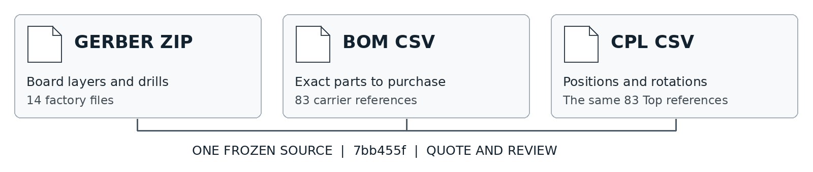
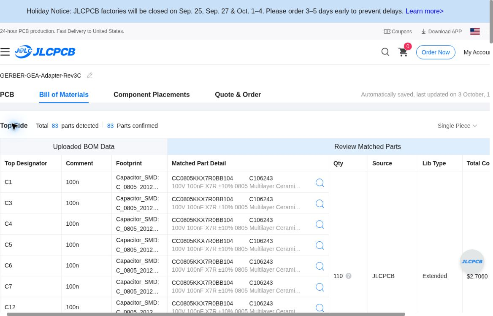
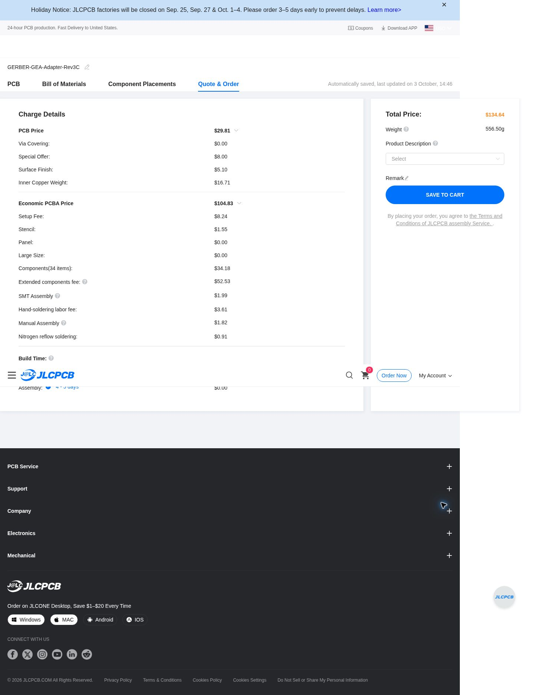
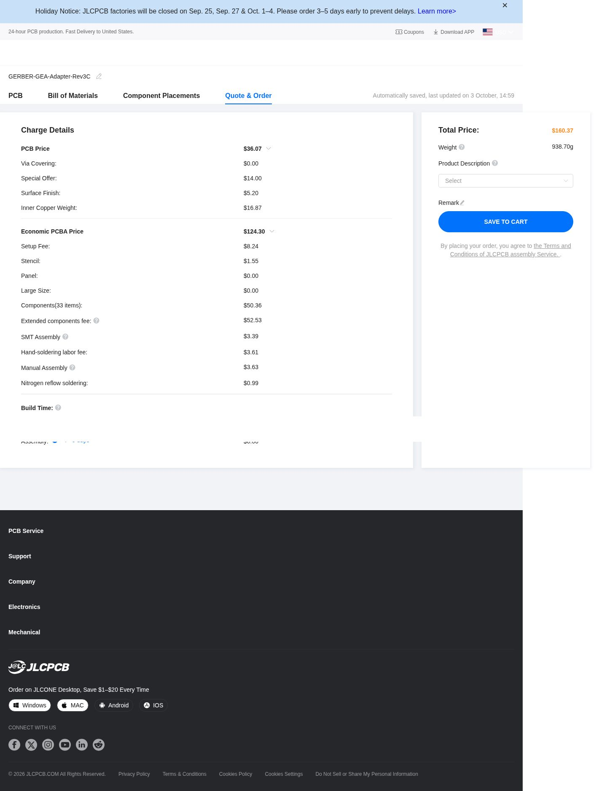

# Rev3C JLCPCB quote and ordering guide

## Start with a quote and review

The selected 83-part Rev3C prototype source has complete JLCPCB quotes of **$134.64 for 5 assembled carriers** and **$168.91 for 10**, refreshed October4,2026 at04:16 UTC against corrected source `b53cfca`, with all83 exact codes stocked. The totals remain the same as October3.  Shipping, taxes, separately purchased XIAO modules, module-side headers/installation, programming, functional testing and a case are excluded. This design was selected on October 3, 2026. It remains **unqualified for manufacture or appliance connection** until the release gates below are closed.

Both GE power inputs, automatic PIN1 priority, the buck and C3/C6 interfaces remain. No extra USB circuitry was added. Disconnect the appliance before powered USB.

For historical cost comparison, the stock-corrected **80-part baseline** has complete quotes of **$130.39 for 5** and **$160.37 for 10**, under the same observed PCB and assembly settings. Its source is `ca1fdb1261af8b32a1bf353d37f40439ead5c3b0`; only D16/D17 sourcing changes to reviewed MCC C668891, with original switches, fuses and topology retained. The higher-rated option costs **$4.25 more per five-board batch** or **$8.54 more per ten-board batch**, about **$0.85 per carrier**. These are complete assembly quote differences, before shipping and tax.

## Keep the selected three files together

Download [Gerber ZIP](manufacturing/GERBER-GEA-Adapter-Rev3C.zip), [BOM](manufacturing/BOM-GEA-Adapter-Rev3C.csv) and [CPL](manufacturing/CPL-GEA-Adapter-Rev3C.csv) from this same revision. These relative links select the 83-reference package described below.

The download links above select the current paired review files. The CAD input checkpoint is **d662d1e**; J1’s CPL X/Y now use a documented nominal body datum, with native rotation retained. See the [placement review](validation/PLACEMENT-DATUM-REVIEW.md) and its source-bound proof. Familiar filenames alone do not identify the version.

The October3 quote/screenshot snapshot was source **7bb455fbc85c748f3125ed091a54375de69fbbcc**, frozen package `rev3c-rated-option-7bb455f`, with its older pin-1-anchor CPL. Its frozen CPL was3157 bytes, SHA256 `aedf3c96a88d4ced3028111d3d5cf2d13d135eaa57dc472c9e84bd6f84a9221b`. The corrected `b53cfca` package was uploaded and re-quoted at04:16 UTC on October4: all83 codes matched/stocked for5/10, totals unchanged at$134.64/$168.91. Actual2D/3D library alignment remained unverified because the supplier preview still showed generic placeholders. Refresh stock and approve real placement/process before ordering.

| File | What JLCPCB uses it for | Bytes | SHA-256 |
| --- | --- | ---: | --- |
| GERBER-GEA-Adapter-Rev3C.zip | Copper, solder mask, silkscreen, outline and drills; 14-member native factory package | 221392 | 669346b37b394cbcbb11c41386a494241a1670b662eeca8a5e55609a908dc4af |
| BOM-GEA-Adapter-Rev3C.csv | 83 carrier reference designators and their exact selected parts | 4768 | 27a9dfa850fe996a36c792fb6146548bc59342eda2b05732fa24e173bade1406 |
| CPL-GEA-Adapter-Rev3C.csv |83 refs; J1 nominal body datum, native angles and Top layer | 3156 | a1f17d5e6018b582694428e374c18ecc110410482ab69022347bd8cf62ea37b2 |

The 80-part baseline uses a different matched trio from source **ca1fdb1261af8b32a1bf353d37f40439ead5c3b0**, package `rev3c-dual-input-ca1fdb1`. Use its own 80-reference BOM and CPL together with its own Gerber ZIP. Do not mix the packages.

| Baseline file | Bytes | SHA-256 |
| --- | ---: | --- |
| GERBER-GEA-Adapter-Rev3C.zip | 202906 | b6e92d609202072d2e2e1e891b856ad3f1f08da8147d9e17ffe5fa91d5bebcd0 |
| BOM-GEA-Adapter-Rev3C.csv | 4536 | c2f91bfdc9b2297b04b02ac2eb1e700dd9519a01de9157bca032e91208f62bf8 |
| CPL-GEA-Adapter-Rev3C.csv | 3039 | bf1676c4ed4d19dc245e8b2ab7b3205ea761c75928785bf963c37041701db1e2 |

## Quote steps

1. Open the official [JLCPCB quote page](https://cart.jlcpcb.com/quote). Choose Standard PCB/PCBA and upload only the matching Gerber ZIP with **Add gerber file**. Check the parsed board in Gerber Viewer: 4 layers and 99 × 40 mm. A displayed 40 × 99 mm detection is the same rectangle; verify outline, layer order and drills against native plots.

2. Reproduce the observed comparison settings: **FR-4 TG135, 4 layers, Single PCB, one design, 1.6 mm, green solder mask, white silkscreen, LeadFree HASL, 1 oz outer and 1 oz inner copper**. Choose PCB quantity **5 or 10**. The native export job reports 35 µm on all layers; that metadata has not established a mandatory electrical stackup. The supplier's 0.5 oz inner default was explicitly changed to 1 oz. If comparing 0.5 oz inner copper, label it as a separate option pending an evaluated design variant. LeadFree HASL is the observed quote assumption; the CAD source did not specify a finish. [Official copper guidance](https://jlcpcb.com/help/article/jlcpcb-copper-weight)

   Other observed settings: plugged vias, unspecified via-plating method, minimum via hole/diameter selection 0.3 mm/(0.4/0.45 mm), regular ±0.2 mm outline tolerance, Remove Mark and Flying Probe Fully Test. No gold fingers, castellations, press-fit, edge plating, blind slots, UL marking, backdrill or humidity card. Layer sequence and stackup were not custom-specified. [Actual PCB settings screenshot](images/ordering/five-board-pcb-settings.jpg)

3. Enable **PCB Assembly**, then choose **Economic, Top Side**, with assembled quantity equal to PCB quantity. Use **By Customer (Self-Service)** part selection. The successful quote includes J1 RJ45 and J5/J6 female module sockets. XIAO C3/C6 modules and their male headers are separate purchases. [Actual assembly settings screenshot](images/ordering/five-board-assembly-settings.jpg), [published assembly capabilities](https://jlcpcb.com/capabilities/pcb-assembly-capabilities)

4. Continue to Bill of Materials. Upload the matching **BOM** and **CPL**, verify both filenames, then click **Process BOM & CPL**. Check every reference, exact JLC part code/MPN, package, value/rating and stock. The end state must be **83 detected / 83 confirmed for selected 7bb455f**, or **80 detected / 80 confirmed for baseline ca1fdb1**. Both quantities were independently checked against each source's frozen BOM. Duplicate-match advisories can leave matching rows initially unchecked; confirm exact matches before selecting them. Resolve any shortage explicitly. Do not silently substitute or choose **Do not place** to make the quote appear complete. [BOM format](https://jlcpcb.com/help/article/bill-of-materials-for-pcb-assembly), [CPL format](https://jlcpcb.com/help/article/pick-place-file-for-pcb-assembly)

5. Review **Component Placements** against native plots, CPL and package datasheets. Check board orientation, X/Y origin and units, Top layer, rotations, pin 1, diode/zener polarity, IC orientation, RJ45 and socket through-hole placement, and the TI exposed-pad/stencil requirements. The observed cloud preview remained “Generating PCB...” with reference placeholders; it did not provide usable 3D models. Passing to the pricing tab is not placement approval. Supplier graphics/placeholders do not establish physical fit. Native plot/CPL parity and physical assembly approval are separate checks. [Observed placement preview](images/ordering/placement-preview.jpg), [assembly review responsibilities](https://jlcpcb.com/help/article/terms-and-conditions-of-jlcpcb-assembly-service)

   Genuine KiCad 9.0.9 native ERC/DRC report zero findings; CAD/CAM parity has passed; the separately typed body-datum export requires current validation and actual supplier-library pose review. Those results do not establish electrical, functional or thermal qualification.

6. Open **Quote & Order** and record the complete PCB + PCBA total. Stop here for quote review. The supplier counts **34 unique component groups for selected 7bb455f**, versus **33 for baseline ca1fdb1**. The placed reference counts remain **83 and 80 per board**, respectively. These quotes include exact parts with no omissions or substitutions.

## Observed complete quote totals

| USD | 5 assembled carriers | 10 assembled carriers |
| --- | ---: | ---: |
| PCB | 29.81 | 36.07 |
| Economic PCBA | 104.83 | 132.84 |
| PCB + PCBA total | **134.64** | **168.91** |
| Per carrier, rounded | 26.93 | 16.89 |
| Components, included in PCBA | 34.18 | 58.70 |
| Extended-part fee, included in PCBA | 52.53 | 52.53 |

| Matched source comparison, USD | 5 assembled carriers | 10 assembled carriers |
| --- | ---: | ---: |
| 80-reference baseline ca1fdb1 | **130.39** | **160.37** |
| 83-reference selected 7bb455f | **134.64** | **168.91** |
| Higher-rated option batch premium | **4.25** | **8.54** |

The baseline PCB subtotals are the same $29.81 / $36.07; its Economic PCBA subtotals are $100.58 / $124.30. All 80 exact reference/code matches were independently verified at both quantities. Original baseline and selected input-protection qualification limits remain open.

Extended-part fees are separate from component purchase cost. PCBA also includes setup, stencil, SMT assembly, hand-soldering, manual assembly and nitrogen reflow. No fixture fee/warning appeared in the final quote; engineering review may still add process charges. Prices and stock can change.

## Release before ordering

The observed quote defaults had **Confirm Production file = No** and **Confirm Parts Placement = No**. They are quote defaults, not recommended production sign-offs. Flying-probe PCB testing is not an assembled-board power-on or functional test. Review any required production/placement confirmation, stencil/process changes and added fees before approval.

Before ordering, close the engineering gates: actual appliance source/current/transient envelope; both input paths and priority/startup/retry behavior; voltage loss and thermal/energy bounds; PMOS differential and gate-clamp behavior; TI package/stencil process; actual module seating, USB/button access, enclosure and RF qualification. A successful quote or 40 V switch rating does not establish appliance compatibility or a 40 V board rating.

After source qualification, complete exact-part and supplier production/placement review. Refresh stock and prices, verify the final quantity and total including shipping and tax, delivery method, payment and visible cancellation/refund terms. The later **Save to Cart → item review → Secure Checkout → shipping/payment** flow was not exercised for this source. [Official PCBA ordering guide](https://jlcpcb.com/help/article/how-do-i-place-a-pcba-order)

Screenshots are unchanged captures of the official JLCPCB cloud quote sessions, inspected for account/address/payment details. They contain no entered address or payment data. Selected-source quote observations are from approximately 21:46–21:48 UTC on October 3, 2026; baseline quotes followed later that evening. The displayed build estimates are not delivery promises; the observed banner listed an October 1–4 factory closure. No landed shipping total has been verified.
