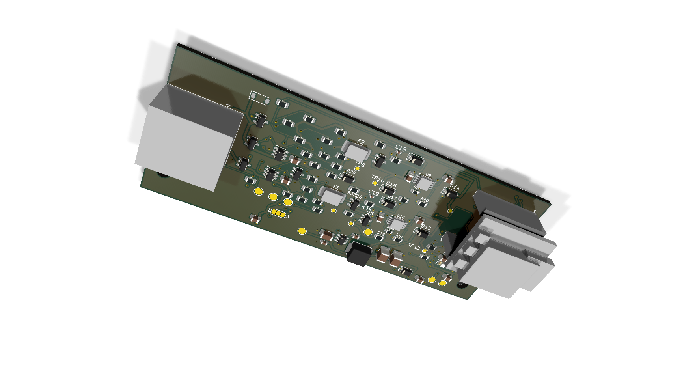

# PCB Rev 3C review candidate (socketed XIAO)

Rev 3C is a design-review variant of [Rev 3B](../rev3b/README.md): the same 99 x 40 mm, four-layer, 1.6 mm board, bus, power, and LED circuitry, but the XIAO ESP32-C3 module is socketed instead of soldered down flush. It is not appliance-qualified and not ready to order. The [PCB revision index](../README.md) still points to [Rev 2.2](../rev2.2/README.md).

[Back to the PCB revision index](../README.md) · [Ordering guide](../ORDERING.md) · [Firmware examples](../../firmware/README.md) · [Rev 3C enclosure](../../case/rev3c/README.md)

## What's different from Rev 3B

Rev 3C replaces Rev 3B's soldered-down XIAO footprint with two factory-populated female 1x7 **HCTL PM254-1-07-Z-8.5** ([LCSC C2897370](https://datasheet.lcsc.com/datasheet/pdf/87e2b5b113f4df247d2b8d5758217346.pdf?productCode=C2897370)) sockets at `J5`/`J6`. You buy a pre-soldered module separately and plug it in — no soldering required on your part. Everything else (bus and power circuitry, the LEDs, the two mounting points, and automatic GE appliance pin-1/pin-3 power selection) is inherited unchanged from Rev 3B.

The carrier's `EN` pull-up resistor and its link between `J2` pin 6 and `J3` pin 1 have been removed, since `EN` is no longer brought out to a side pin. Use the module's own **RESET** button for manual recovery instead; see [J2 backup programming](#j2-backup-programming) below.

The factory carrier's bill of materials does not include the XIAO module itself — you supply it.

The [KiCad 9 project](design/GEA-Adapter-Rev3C.kicad_pro), [schematic source](design/GEA-Adapter-Rev3C.kicad_sch), and [PCB source](design/GEA-Adapter-Rev3C.kicad_pcb) are available for design review.

## Module

Buy a [Seeed Studio XIAO ESP32-C3 Pre-Soldered, SKU 102010633](https://www.seeedstudio.com/Seeed-Studio-XIAO-ESP32C3-Pre-Soldered-p-6331.html) (USD 5.99 as checked October 1, 2026, before tax and shipping, separate from the carrier board; carrier pricing is still pending). This SKU includes its own antenna.

> [!IMPORTANT]
> Do not use the unsoldered SKU 113991054 as a plug-in replacement — it has no header pins to mate with the carrier's sockets. Other XIAO models (C6, S3, and similar) are not drop-in compatible; use the pre-soldered XIAO ESP32-C3 SKU above.

### Installing the module

1. Disconnect all power from the carrier first.
2. Align all 14 pins with the `J5`/`J6` sockets. The sockets are not keyed, so nothing stops the module from being inserted reversed or offset by a row — match the module's USB-C connector to the case's USB-C opening and the carrier's orientation mark, with no pins left overhanging either socket.
3. Press the module straight down until fully seated.
4. Plug the module's U.FL antenna connector in carefully, straight down, before enclosing the board.

The module's power pins are not protected against reversed or offset insertion — double-check orientation before applying power.

## One power source at a time

Rev 3C is not appliance-qualified. It carries the same prototype power, transient, and thermal qualification limits as Rev 3B — do not connect this board to an appliance. Only one external supply may be physically connected at a time: USB, appliance power, or a regulated 5 V supply on `J2`. There is no simultaneous-source protection, and appliance power energizes the same rail as USB VBUS. The module's `3V3` pin is output only from its onboard regulator — never drive or inject power into it.

## J2 backup programming

`J2` is a permanent, factory-populated, SMD 2x3 header:

| J2 pin | Signal |
| --- | --- |
| 1 | Regulated 5 V in, through an isolation diode |
| 2 | Ground |
| 3 | Boot (GPIO9) |
| 4 | Module RX (GPIO20) |
| 5 | Module TX (GPIO21) |
| 6 | Not connected |

Unlike Rev 3B, pin 6 is not a reset line. Use the module's onboard **RESET** button if you need to manually reset or recover it during UART programming.

Use a **3.3 V logic** USB-to-UART adapter: adapter TX to J2 pin 4, adapter RX to pin 5, with a common ground. Power `J2` from a regulated 5 V supply with adequate current. Hold Boot low while entering the bootloader, then release it once programming starts. Pin 1 accepts 5 V only — never connect it, or any other 5 V source, to a 3.3 V signal pin or the module's `3V3` output.

Native USB-C flashing is unchanged from Rev 3B. USB and appliance power still may not be connected at the same time.

## GE bus connections

Same GPIOs as Rev 3B — see the [firmware guide](../../firmware/README.md) for the matching ESPHome configuration and the `seeed_xiao_esp32c3` board substitution.

## Case

The [Rev 3C enclosure](../../case/rev3c/README.md) accounts for the taller, socketed module position: a raised USB-C window, relocated BOOT/RESET tool access, and under-board tail relief for the sockets. Internal-antenna, external-bulkhead, and captive-magnet options carry over from Rev 3B. The socketed mating height is not yet physically verified; fit and vibration resistance still need a bench check.

## Review material

The final KiCad 9 full-severity ERC and DRC report zero errors, warnings, and unconnected items, with zero schematic-to-board parity differences. These checks do not establish assembled-board electrical, thermal, mechanical, RF, or appliance compatibility.

The carrier manufacturing files are available for design review and quoting: [BOM](manufacturing/BOM-GEA-Adapter-Rev3C.csv), [CPL](manufacturing/CPL-GEA-Adapter-Rev3C.csv), and [Gerber/drill ZIP](manufacturing/GERBER-GEA-Adapter-Rev3C.zip). The BOM and CPL each contain 82 carrier parts, including J1, J2, J5, and J6; the XIAO module is supplied separately. Pricing is pending; no quote or production release is implied.

Review views: [top render](images/rev3c-render-top.png), [bottom render](images/rev3c-render-bottom.png), and [oblique render](images/rev3c-render-oblique.png). Copper views are available for [front](images/rev3c-copper-f-cu.svg), [inner ground](images/rev3c-copper-in1-cu.svg), [inner routing](images/rev3c-copper-in2-cu.svg), and [bottom](images/rev3c-copper-b-cu.svg) comparison. The [schematic PDF](validation/schematic.pdf) is part of the review package. These renders are simplified clearance envelopes, not supplier cosmetic CAD; the case CAD checks pass, but physical height, retention, and prototype fit remain unverified.

Rev 3C is not orderable. See [Rev 2.2](../rev2.2/README.md) and its [ordering guide](../ORDERING.md) for the current manufacturing candidate.
