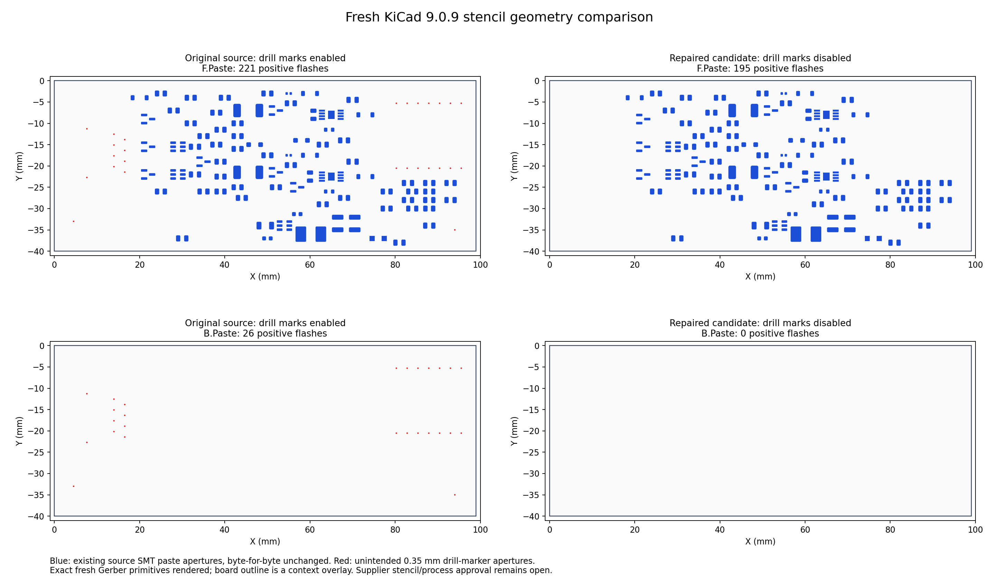

# Rev3C stencil and fresh native checks

The current Gerber package removes unintended drill-center graphics from fabrication layers. The previous plot setting added 26 positive 0.35 mm openings to each paste layer at J1, J5, J6, H1 and H2 drilled pads. Those pads exclude paste in the native design. Bottom paste contained only those unwanted openings.

The source correction changes `pcbplotparams`' `drillshape` from 1 to 0. It preserves every other byte of the PCB, both appliance power inputs and automatic priority, the C3/C6 interfaces, component identities, nets, tracks, zones, outline and rules. BOM and CPL bytes are unchanged. Regenerated Gerbers remove the appended drill-center graphics; separate drill geometry and stackup metadata are unchanged.

Fresh checks on October 4, 2026 used genuine KiCad 9.0.9 with the pinned official libraries:

| Check | Result |
| --- | --- |
| Full-severity ERC | 0 errors, 0 warnings |
| All-track DRC with schematic parity | 0 errors, 0 warnings, 0 open connections, 0 parity differences |
| Front paste | 221 to 195 flashes; all 195 existing SMT apertures preserved |
| Bottom paste | 26 to 0 flashes |
| Factory comparison | All 14 files agree after removing creation timestamps and the old appended drill markers |
| Assembly sources | 83 matching BOM/CPL references; geometry and purchasing records unchanged |
| Shared firmware source audit | 150 static checks passed on restored `5542734e`; firmware and hardware pin geometry are unchanged; hosted job 47 passes all eight config/compile profiles at `2d5a42c`, including the four shared C3/C6 variants |

The [source-bound proof](validation/stencil-marker-repair-proof.json) records exact source, factory-file and tool pins. The [native ERC](validation/native-kicad-9.0.9-erc.json) and [DRC](validation/native-kicad-9.0.9-drc.json) are fresh reports. The original 9.0.2 installation produced library-link/content warnings; replacing it with the declared 9.0.9 tool and libraries resolved those warnings without changing electrical rules.

Use the current [Gerber ZIP](manufacturing/GERBER-GEA-Adapter-Rev3C.zip) with its matching BOM/CPL listed in the [ordering guide](ORDERING.md). The October 5 [quote receipt](validation/JLCPCB-QUOTE-2026-10-05.json) and current ordering-guide cost screenshots use this corrected ZIP: USD 134.64 for five or 168.92 for ten assembled carriers, before shipping, tax and separate XIAO modules. Actual placement, stencil and assembly approval remain open.

Two preserved front-paste apertures belong to unplaced D8 (DNI). The assembler must review stencil handling for that unplaced part, the TI exposed pad, solder delivery, placement and through-hole processes. A source-matched export is not supplier process approval. Appliance voltage/current/transient limits, loaded startup and thermal behavior, enclosure/RF fit and physical testing remain open in [POWER-QUALIFICATION.md](POWER-QUALIFICATION.md). Disconnect the appliance before powered USB and keep UART VCC disconnected.

The generator behavior is traceable to the official KiCad 9.0.9 [board-layer plotter](https://gitlab.com/kicad/code/kicad/-/blob/9.0.9/pcbnew/plot_board_layers.cpp) and [item plotter](https://gitlab.com/kicad/code/kicad/-/blob/9.0.9/pcbnew/plot_brditems_plotter.cpp). Their global drill-mark plotting explains why a marked drill can appear on a paste layer even when the pad itself excludes that layer.
